# Section 1: Introduction

## 1.1 Background

The rapid adoption of digital technologies in higher education has fundamentally transformed the manner in which academic assessments are conducted. Traditional paper-based examinations, while familiar, present numerous logistical challenges including manual distribution, supervision resource requirements, and delayed result processing. In response, many educational institutions have transitioned toward online examination platforms that offer greater flexibility and scalability.

However, the shift toward digital assessment has simultaneously introduced a critical vulnerability — the integrity of the examination process. The absence of physical supervision in remote or computer-based examination environments has led to an increase in academic dishonesty. Students may exploit screen-sharing utilities, secondary devices, or unauthorised applications to gain unfair advantages during assessments. Conventional online examination tools often rely on browser-based lockdown mechanisms that are easily circumvented, or they depend on third-party proctoring services that raise privacy concerns and incur recurring costs.

Furthermore, many existing solutions are designed as web applications, which inherently lack the low-level operating system access necessary for robust security enforcement. A browser cannot reliably monitor window switching behaviour, detect prohibited background processes, or intercept clipboard and keyboard events at the system level. These limitations create an operational gap between the security expectations of examiners and the actual enforcement capabilities of the platform.

In this context, a desktop-native examination platform that integrates AI-assisted proctoring, real-time monitoring, and secure session management represents a significant advancement over existing solutions. By operating at the operating system level, such a platform can enforce examination integrity far more effectively than browser-based alternatives, while simultaneously providing a seamless and modern user experience.

## 1.2 Problem Statement

Existing online examination platforms suffer from several critical shortcomings that compromise the integrity and reliability of the assessment process:

1. **Insufficient Security Enforcement**: Browser-based examination tools cannot reliably detect or prevent window switching, screen capture attempts, clipboard manipulation, or the execution of prohibited applications (e.g., remote desktop software, virtual machines) during an active examination session.

2. **Lack of Real-Time Identity Verification**: Most platforms perform identity verification only at the start of an examination, if at all. There is no continuous mechanism to ensure that the individual taking the examination remains the same person who registered for it. Face mismatches, multiple faces, and the use of printed photographs are not systematically addressed.

3. **Poor Examiner Visibility**: Examiners typically have no real-time visibility into the behaviour of students during a live examination. Proctoring events, integrity violations, and connectivity issues are either not tracked or reported only after the examination has concluded.

4. **Fragile Session Management**: Network disruptions during an active examination frequently result in the complete loss of progress. Existing platforms rarely support seamless session reconnection, local answer caching, or graceful degradation under adverse network conditions.

5. **Limited Assessment Flexibility**: Many platforms support only multiple-choice questions. Mixed-format assessments combining MCQ and essay-type questions — with separate grading workflows for each — are poorly supported.

The problem, therefore, is the absence of a comprehensive, secure, and desktop-native examination platform that addresses these deficiencies holistically — one that provides robust proctoring, real-time monitoring, secure session management, and flexible assessment capabilities within a single integrated system.

## 1.3 Aim & Objectives

### Aim

The aim of this project is to design and develop **ExamApp**, a secure desktop examination platform that provides a comprehensive solution for conducting proctored academic assessments with real-time monitoring, AI-assisted identity verification, and robust session management.

### Objectives

The following specific objectives were defined for the project:

1. **To develop a role-based authentication system** that supports separate workflows for Examiners and Students, incorporating facial biometric enrollment during registration and JWT-based session security.

2. **To implement a complete exam lifecycle management module** that enables examiners to create classes, manage student enrollments, design mixed-format examinations (MCQ and Essay), and transition exams through a defined lifecycle (Draft → Scheduled → Live → Closed).

3. **To build a secure, desktop-native exam-taking environment** that enforces examination integrity through operating system-level controls, including window switch detection, prohibited process scanning, clipboard monitoring, and cursor tracking via a custom C++ native hook DLL.

4. **To integrate AI-assisted proctoring capabilities** utilising computer vision models (MediaPipe, FaceNet) for real-time face detection, liveness verification (blink detection via Eye Aspect Ratio, head movement challenges), gaze tracking, and periodic identity re-verification during active exam sessions.

5. **To design and implement a real-time communication layer** using WebSocket technology that enables heartbeat monitoring, live answer synchronisation, proctoring event streaming, and examiner-to-student control commands (pause, terminate, end exam).

6. **To develop a resilient session management system** that supports seamless reconnection after network disruptions, local encrypted answer caching, and graceful session finalisation under various termination scenarios (manual submit, timer expiry, examiner termination, network timeout).

7. **To create a comprehensive reporting and review module** that provides students with detailed report cards (MCQ/Essay score breakdowns, integrity scores) and examiners with tools for essay grading, proctoring event review, and session-level analytics.

## 1.4 Scope & Limitations

### Scope

The ExamApp platform encompasses the following functional scope:

- **User Management**: Role-based registration and authentication for Examiners and Students with facial biometric enrollment.
- **Class & Enrollment Management**: Class creation (Examiner), join-by-code enrollment (Student), and examiner-controlled enrollment approval/rejection.
- **Exam Lifecycle Management**: Full exam CRUD operations, question management (MCQ + Essay), configurable proctoring settings, and exam status transitions.
- **Secure Exam-Taking Environment**: Desktop-native lockdown enforcement, camera-based proctoring, and real-time event monitoring.
- **Real-Time Communication**: Bidirectional WebSocket channels for heartbeat monitoring, answer synchronisation, proctoring event streaming, and examiner control commands.
- **Session Management**: Robust session state machine (Pending → Verifying → Active → Locked → Submitted/Terminated) with reconnection support.
- **Grading & Review**: Automatic MCQ grading, manual essay grading by examiners, integrity score computation, and detailed score breakdowns.
- **Reporting**: Student-facing report cards, performance history, and examiner-facing session analytics.

### Limitations

The following limitations are acknowledged:

1. **Platform Restriction**: The desktop client application is developed exclusively for the Microsoft Windows operating system. macOS and Linux are not supported in the current version.
2. **No Web or Mobile Client**: Access is limited to the desktop application; no web-based or mobile client has been developed.
3. **AI Microservice Stub**: An AI microservice for offloading proctoring ML workloads was architected but remains in stub/mock form. Proctoring logic currently executes within the client process.
4. **Development Database**: The system uses SQLite for development purposes. PostgreSQL integration is configured but not fully deployed for production.
5. **No HTTPS/TLS**: The current deployment operates over plaintext HTTP. TLS encryption for REST API and WSS for WebSocket channels have not been implemented.
6. **Local Cache Encryption Deferred**: The SQLCipher-based encrypted local answer cache was planned but deferred due to Windows build complexity. The current local cache uses standard SQLite.
7. **Input Validation Gaps**: Server-side input validation for question content (text length, option validation) and essay answers (maximum length enforcement) is incomplete.
8. **Single-Institution Deployment**: The system is designed for single-institution deployment and does not support multi-tenancy.

## 1.5 Motivation

The primary motivation for undertaking this project was the recognition that existing online examination tools fail to adequately balance security, usability, and affordability. Commercial proctoring services such as Respondus LockDown Browser and ProctorU impose significant licensing costs and raise privacy concerns by transmitting biometric data to third-party servers. Open-source alternatives, meanwhile, are overwhelmingly browser-based and lack the system-level access necessary for meaningful security enforcement.

As a student of Software Engineering, the opportunity to design and build a full-stack, real-time, desktop-native application presented a compelling learning experience that encompassed multiple advanced topics: client-server architecture, WebSocket-based real-time communication, computer vision and AI integration, database design, operating system-level security hooks (C++ DLL interop), and modern UI/UX development with Qt6. The project offered a rare opportunity to integrate these diverse technical domains into a single cohesive product.

Furthermore, the practical utility of such a platform within an academic institution provided additional motivation. A secure, self-hosted examination tool that operates without recurring licensing costs and keeps biometric data on institutional infrastructure directly addresses the cost and privacy concerns associated with commercial alternatives.

---

# Section 2: Methodology (Software Process Model)

## 2.1 Development Life Cycle Selected

The **Iterative and Incremental Development Model** was selected as the software process model for the development of ExamApp. Under this model, the system was developed through a series of iterative cycles, each of which produced a working increment of the software that built upon the functionality delivered in the preceding iteration.

### Justification

The Iterative and Incremental model was chosen for the following reasons:

1. **Evolving Requirements**: While the core feature set (authentication, exam management, proctoring, session handling) was identified at the project's outset, the precise implementation details — such as the proctoring architecture (two-process camera model), the WebSocket message protocol, and the dual access model (class-level and exam-level enrollment) — emerged and evolved during development. A rigid, plan-driven model such as Waterfall would not have accommodated these refinements.

2. **Solo Developer Context**: As a solo development effort, formal Agile Scrum ceremonies (daily standups, sprint reviews, retrospectives) were neither practical nor necessary. The Iterative model preserved the benefits of incremental delivery and feedback-driven refinement without imposing unnecessary process overhead.

3. **Risk Mitigation Through Early Integration**: Each iteration integrated components end-to-end (e.g., "server routes + client UI + WebSocket layer for exam sessions"), enabling early detection of integration issues and architectural mismatches. This was particularly valuable for the real-time WebSocket communication and native DLL interop layers, which carried higher technical risk.

4. **Continuous Refinement**: The codebase underwent continuous refinement between iterations. For example, the client was initially built with PyQt6 and later migrated to PySide6 (LGPL license), the face verification threshold was tuned from 0.6 to 0.8, and the local cache was restructured to support change-only answer writes. These refinements were naturally accommodated within the iterative framework.

### Iterative Development Lifecycle Diagram

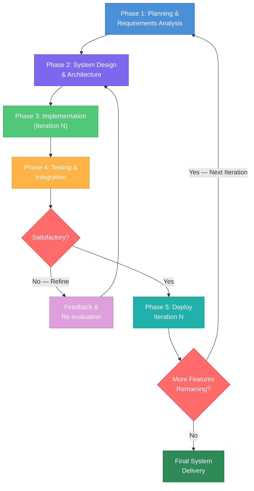

### Development Iterations Summary

| Iteration | Focus Area | Key Deliverables |
|-----------|-----------|-----------------|
| 1 | Core Backend & Authentication | FastAPI server, SQLAlchemy models, JWT authentication, user registration with face enrollment |
| 2 | Exam & Class Management | Class CRUD, enrollment workflows, exam lifecycle (Draft → Scheduled → Live → Closed), question management |
| 3 | Client Application Foundation | PySide6 desktop client, login/signup UI, main window router, navigation architecture |
| 4 | Exam Session & WebSocket Layer | Session state machine, WebSocket channels (student + examiner), heartbeat protocol, answer synchronisation |
| 5 | Proctoring & Security | Camera monitoring (two-process architecture), activity monitor, input hooks (C++ DLL), event logging |
| 6 | Grading, Review & Reporting | Auto MCQ grading, essay review UI, integrity scoring, student report cards, performance analytics |
| 7 | Optimisation & Polish | Adaptive FPS, lazy model loading, change-only syncing, UI refinements, E2E testing |

---

## 2.2 Requirement Engineering

### 2.2.1 Functional Requirements

The functional requirements were derived from a systematic analysis of the implemented server API endpoints, client UI modules, and WebSocket communication protocol.

| FR ID | Requirement | Priority | Module |
|-------|------------|----------|--------|
| FR-01 | The system shall allow users to register as either an Examiner or a Student, providing personal details (name, email, institution, department) and a password. | High | Authentication |
| FR-02 | The system shall capture a facial photograph during registration and extract a biometric embedding for future identity verification. | High | Authentication |
| FR-03 | The system shall authenticate users via email and password, issuing a JSON Web Token (JWT) upon successful login. | High | Authentication |
| FR-04 | The system shall allow authenticated users to verify their identity by comparing a live facial image against their stored biometric embedding. | High | Authentication |
| FR-05 | The system shall allow examiners to create classes with an auto-generated unique join code. | High | Class Management |
| FR-06 | The system shall allow students to join a class using the class join code, creating a pending enrollment request. | High | Class Management |
| FR-07 | The system shall allow examiners to approve or reject pending student enrollment requests for their classes. | High | Class Management |
| FR-08 | The system shall allow examiners to create examinations within their classes, specifying title, duration, schedule, and proctoring configuration parameters. | High | Exam Management |
| FR-09 | The system shall allow examiners to add both Multiple Choice (MCQ) and Essay-type questions to draft examinations. | High | Exam Management |
| FR-10 | The system shall enforce an exam lifecycle with defined state transitions: Draft → Scheduled → Live → Closed. | High | Exam Management |
| FR-11 | The system shall prevent an exam from transitioning to Live status if it contains no questions. | Medium | Exam Management |
| FR-12 | The system shall allow students to request access to specific exams via an exam join code, subject to examiner approval. | High | Exam Access |
| FR-13 | The system shall allow students to start an exam session only if the exam is Live, the student has approved access, and the student has a face enrollment on file. | High | Session Management |
| FR-14 | The system shall create exam sessions in a "Verifying" state, requiring successful face verification before transitioning to "Active" status. | High | Session Management |
| FR-15 | The system shall support session reconnection — if a student disconnects during an active or verifying session, they shall be able to reconnect to the same session without creating a new one. | High | Session Management |
| FR-16 | The system shall automatically grade MCQ answers upon exam submission by comparing selected options against stored correct answers. | High | Grading |
| FR-17 | The system shall allow examiners to manually grade essay-type answers by assigning scores and comments. | High | Grading |
| FR-18 | The system shall compute an integrity score for each session based on the number and severity of proctoring events recorded during the examination. | Medium | Integrity |
| FR-19 | The system shall maintain a persistent WebSocket connection during active exam sessions for heartbeat monitoring, answer synchronisation, and proctoring event streaming. | High | Real-Time Communication |
| FR-20 | The system shall allow examiners to terminate a student's active session in real time, with the termination command delivered via WebSocket and a REST API fallback. | High | Examiner Controls |
| FR-21 | The system shall detect and log proctoring events including face absence, multiple faces, face mismatch, gaze deviation, window switching, screenshot attempts, prohibited processes, and clipboard writes. | High | Proctoring |
| FR-22 | The system shall provide students with a dashboard displaying upcoming assessments, recent results, and quick performance statistics. | Medium | Student Dashboard |
| FR-23 | The system shall provide examiners with a dashboard displaying exam management tools, metrics overview, and a live alert feed for active exam sessions. | Medium | Examiner Dashboard |
| FR-24 | The system shall provide students with detailed report cards showing MCQ scores, essay scores, total scores, integrity scores, and per-question answer review. | Medium | Reporting |
| FR-25 | The system shall cache student answers locally on disk during an active exam session, syncing them to the server periodically and upon any change, to prevent data loss during network disruptions. | High | Local Caching |

### 2.2.2 Non-Functional Requirements

| NFR ID | Category | Requirement | Implementation Detail |
|--------|----------|------------|----------------------|
| NFR-01 | Performance | The server shall respond to REST API requests within 500 milliseconds under normal load conditions. | FastAPI async endpoints with SQLAlchemy ORM |
| NFR-02 | Performance | WebSocket heartbeat messages shall be processed within the configured timeout interval of 15 seconds. | Server-side heartbeat monitor runs every 5 seconds |
| NFR-03 | Performance | Camera monitoring shall operate at an adaptive frame rate (10 FPS active, 2 FPS idle) to minimise CPU usage without compromising detection accuracy. | Two-process camera architecture with lazy model loading |
| NFR-04 | Performance | Local answer cache writes shall occur only when answer content has changed, avoiding unnecessary disk I/O. | Change-detection comparison before SQLite writes |
| NFR-05 | Security | User passwords shall be stored as bcrypt hashes. Plaintext passwords shall never be persisted. | passlib + bcrypt 4.0.1 |
| NFR-06 | Security | All authenticated API endpoints shall require a valid JWT token with an expiry of 720 minutes (12 hours). | python-jose with HS256 algorithm |
| NFR-07 | Security | The system shall detect and flag the execution of prohibited applications (screen sharing tools, virtual machines, remote desktop software) during active exam sessions. | psutil process scanning + WMI VM detection |
| NFR-08 | Security | The system shall intercept keyboard and mouse events at the operating system level using a native C++ hook DLL to detect and prevent unauthorised input actions. | Custom input_hooks.dll compiled via CMake |
| NFR-09 | Security | Face verification shall require a cosine similarity score of at least 0.80 against the stored embedding to confirm identity. | FaceNet-PyTorch embeddings with cosine distance |
| NFR-10 | Usability | The desktop client shall provide a modern, borderless card-based UI with smooth interactions and consistent typography. | PySide6 with custom QSS stylesheets and design tokens |
| NFR-11 | Usability | The exam-taking interface shall display a countdown timer, question navigation sidebar, and clear progress indicators to minimise student cognitive load. | Modular UI widgets: top bar, sidebar, question area |
| NFR-12 | Reliability | The system shall support session continuity after network disruptions, allowing students to reconnect to active sessions without losing previously synced answers. | Local SQLite cache + WebSocket reconnection logic |
| NFR-13 | Reliability | Proctoring events shall be stored with a cryptographic chain hash to provide tamper evidence for the event log. | SHA-256 chain hash computed per event on server |
| NFR-14 | Reliability | The system shall handle session finalisation under multiple termination scenarios (manual submit, timer expiry, examiner termination, network timeout) through a unified finalisation endpoint. | POST /sessions/{id}/finalize with reason-based routing |

---

## 2.3 System Feasibility Analysis

### 2.3.1 Technical Feasibility

The project was assessed as technically feasible based on the following analysis:

- **Programming Language**: Python 3.10+ was selected as the primary development language, offering mature library ecosystems for web development (FastAPI), desktop UI (PySide6/Qt6), computer vision (OpenCV, MediaPipe), and machine learning (FaceNet-PyTorch). Python's cross-domain capabilities eliminated the need for multi-language development for the majority of the system.

- **Backend Framework**: FastAPI was selected for its native support of asynchronous operations (critical for WebSocket handling), automatic OpenAPI documentation generation, Pydantic-based request validation, and high-performance request handling via Uvicorn's ASGI server.

- **Desktop UI Framework**: PySide6 (the official Python binding for Qt6) was chosen over web-based alternatives to achieve operating system-level access. Qt6 provides native window management, custom event handling, and C++ interop capabilities that are unavailable in browser-based environments.

- **Computer Vision**: MediaPipe and FaceNet-PyTorch were evaluated and selected for face detection, liveness verification (blink detection, head movement), and face re-identification. Both libraries operate efficiently on CPU hardware, eliminating the requirement for GPU-equipped student workstations.

- **Native Hooks**: A custom C++ DLL was developed for low-level keyboard and mouse event interception on Windows, compiled via CMake and loaded dynamically by the Python client. This component was necessary because Python-level event hooks lack the reliability and coverage of Windows API hooks.

- **Real-Time Communication**: The `websockets` library was chosen for bidirectional client-server communication, supporting the heartbeat, answer sync, event batch, and examiner control message protocols.

The technology stack was validated through iterative prototyping, confirming that all major technical risks (camera processing latency, WebSocket reliability under reconnection, native DLL stability) were manageable.

### 2.3.2 Operational Feasibility

The system was designed for deployment within a single educational institution:

- **Target Users**: Examiners (faculty members) and Students at a university or college.
- **Deployment Model**: The server would be hosted on institutional infrastructure (LAN or campus server), and the desktop client would be distributed to student workstations.
- **User Training**: The modern, intuitive UI was designed to minimise training requirements. Standard workflows (login, view exams, take exam, view results) follow established UX conventions.
- **Administrative Overhead**: The system is self-contained and does not require ongoing third-party service subscriptions.

### 2.3.3 Economic Feasibility

| Cost Category | Assessment |
|--------------|-----------|
| Development Tools | All tools and frameworks used are open-source and free: Python, FastAPI, PySide6, SQLAlchemy, MediaPipe, FaceNet-PyTorch, OpenCV |
| Database | SQLite (development) and PostgreSQL (production) are both free and open-source |
| Hosting | Requires only a standard server machine on institutional infrastructure; no cloud subscription necessary |
| Licensing | PySide6 is licensed under LGPL, permitting commercial use. All other dependencies are MIT/BSD/Apache licensed |
| Third-Party Services | No external proctoring services, face recognition APIs, or cloud AI services are required. All processing is local |
| **Total Recurring Cost** | **Nil** (excluding institutional infrastructure and electricity costs) |

The project was assessed as economically feasible with no recurring software licensing costs.

---

## 2.4 Tools & Environment Setup

### Development Tools

| Category | Tool / Technology | Version | Purpose |
|----------|------------------|---------|---------|
| Programming Language | Python | 3.10+ | Primary development language for both server and client |
| IDE / Editor | VS Code / Cursor | Latest | Code editing, debugging, integrated terminal |
| Version Control | Git | Latest | Source code versioning and change tracking |

### Backend Stack

| Category | Tool / Technology | Version | Purpose |
|----------|------------------|---------|---------|
| Web Framework | FastAPI | 0.111.0 | REST API + WebSocket endpoint framework |
| ASGI Server | Uvicorn | 0.29.0 | High-performance async server |
| ORM | SQLAlchemy | 2.0.30 | Object-Relational Mapping with Mapped[] type annotations |
| Database Migration | Alembic | 1.13.1 | Schema migration management |
| Database (Dev) | SQLite | Built-in | Lightweight development database |
| Database (Prod) | PostgreSQL | 15+ | Production-grade relational database |
| DB Driver | psycopg2-binary | 2.9.9 | PostgreSQL adapter for Python |
| Authentication | python-jose | 3.3.0 | JWT token generation and validation |
| Password Hashing | passlib + bcrypt | 1.7.4 / 4.0.1 | Bcrypt-based password hashing |
| Validation | Pydantic | 2.7.4 | Request/response schema validation |
| Configuration | pydantic-settings | 2.2.1 | Environment-based settings management |
| Environment | python-dotenv | 1.0.1 | .env file loading |
| File Upload | python-multipart | 0.0.9 | Multipart form data parsing (face images) |
| Face Recognition | facenet-pytorch | 2.5.3 | Face embedding extraction and comparison |
| Image Processing | OpenCV | 4.9.0.80 | Image preprocessing for face detection |
| Image Handling | Pillow | 10.3.0 | Image format conversion and storage |
| Numerical Computing | NumPy | ≥1.26.4 | Array operations for face embeddings |
| WebSocket | websockets | 12.0 | Bidirectional real-time communication |

### Client Stack

| Category | Tool / Technology | Version | Purpose |
|----------|------------------|---------|---------|
| UI Framework | PySide6 | 6.7.0 | Qt6-based desktop GUI (LGPL licensed) |
| Computer Vision | OpenCV | 4.9.0.80 | Camera capture and frame preprocessing |
| Face/Gaze Analysis | MediaPipe | 0.10.14 | FaceMesh (liveness), FaceDetection, Iris tracking |
| HTTP Client (Sync) | requests | 2.31.0 | Synchronous API calls (login, face verification) |
| HTTP Client (Async) | httpx | 0.27.0 | Non-blocking API calls |
| WebSocket Client | websockets | 12.0 | Heartbeat, event sync, answer sync |
| Encryption | cryptography | 42.0.7 | Local cache key management |
| Windows API | pywin32 | 306 | Win32 API for window/cursor/clipboard monitoring |
| Process Management | psutil | 5.9.8 | Prohibited process scanning |
| VM Detection | WMI | 1.5.1 | Virtual machine detection via WMI queries |
| Image Handling | Pillow | 10.3.0 | Snapshot compression before upload |

### Native Components

| Category | Tool / Technology | Purpose |
|----------|------------------|---------|
| Native Hook DLL | C++ (input_hooks.cpp) | System-level keyboard and mouse event interception |
| Build System | CMake | Cross-platform build configuration for the C++ DLL |
| Compiler | MSVC / MinGW | Windows C++ compilation |

### Testing Tools

| Category | Tool / Technology | Purpose |
|----------|------------------|---------|
| Test Framework | pytest | End-to-end and unit test execution |
| Test HTTP Client | requests / httpx | API endpoint testing |

---

# Section 3: System Analysis & Design

## 3.1 Use Case Diagram & Descriptions

### Use Case Diagram

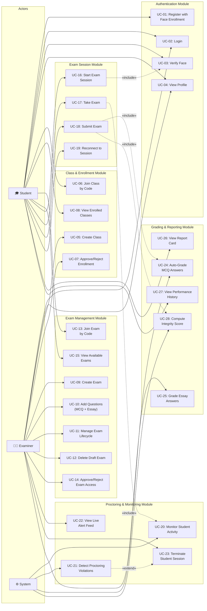

### Use Case Descriptions

| UC ID | Use Case Name | Actor(s) | Precondition | Main Flow | Postcondition | Exceptions |
|-------|--------------|----------|-------------|-----------|--------------|------------|
| UC-01 | Register with Face Enrollment | Student, Examiner | None | 1. User provides name, email, password, role, institution. 2. User captures facial photo via webcam. 3. System extracts 512-dim face embedding. 4. System creates account and stores embedding. 5. System issues JWT token. | Account created with face enrolled | Face not detected (422), Email already exists (409), Embedding save failure (500 + rollback) |
| UC-02 | Login | Student, Examiner | Registered account exists | 1. User provides email and password. 2. System validates credentials. 3. System issues JWT token with role, user_id, face_enrolled status. | User authenticated with valid JWT | Invalid credentials (401) |
| UC-03 | Verify Face | Student | User is logged in, face enrolled | 1. Student captures live photo. 2. System extracts live embedding. 3. System computes cosine similarity against stored embedding. 4. System returns verified/rejected result (threshold ≥ 0.80). | Identity confirmed or rejected | No face detected (422), Face not enrolled (400) |
| UC-04 | View Profile | Student, Examiner | User is logged in | 1. System returns user profile (name, email, role, institution, face status). | Profile displayed | — |
| UC-05 | Create Class | Examiner | Examiner is logged in | 1. Examiner provides class name and description. 2. System generates unique 6-character join code. 3. System creates class record. | Class created with join code | — |
| UC-06 | Join Class by Code | Student | Student is logged in | 1. Student enters 6-character join code. 2. System locates class. 3. System creates pending enrollment request. | Enrollment request submitted (awaiting approval) | Invalid code (404), Already enrolled (409) |
| UC-07 | Approve/Reject Enrollment | Examiner | Enrollment request exists for examiner's class | 1. Examiner views pending enrollments. 2. Examiner approves or rejects each request. | Enrollment approved or removed | Class not owned (404) |
| UC-08 | View Enrolled Classes | Student | Student is logged in | 1. System returns all classes student is enrolled/pending in with approval status. | Class list displayed | — |
| UC-09 | Create Exam | Examiner | Examiner owns a class | 1. Examiner specifies title, duration, schedule, proctoring settings. 2. System generates unique exam join code. 3. System creates exam in Draft status. | Exam created in Draft | Class not owned (404) |
| UC-10 | Add Questions | Examiner | Exam exists in Draft status | 1. Examiner adds MCQ (with options + correct answer) or Essay (with word limits) questions. 2. System assigns sequential order index. | Question added to exam | Non-draft exam (400), MCQ missing options (422) |
| UC-11 | Manage Exam Lifecycle | Examiner | Exam exists | 1. Examiner transitions exam status: Draft → Scheduled → Live → Closed. 2. System validates transition rules (must have questions to go Live). | Exam status updated | Invalid transition (400), No questions for Live (400) |
| UC-12 | Delete Draft Exam | Examiner | Exam in Draft status, no sessions | 1. Examiner deletes exam. 2. System removes exam, questions, and access requests. | Exam deleted | Non-draft (400), Has sessions (400) |
| UC-13 | Join Exam by Code | Student | Student is logged in | 1. Student enters exam join code. 2. System creates pending access request. | Access request submitted | Invalid code (404), Already requested (409) |
| UC-14 | Approve/Reject Exam Access | Examiner | Access request exists for examiner's exam | 1. Examiner views requests. 2. Examiner approves or rejects. | Access granted or removed | Exam not owned (404) |
| UC-15 | View Available Exams | Student | Student has approved access (class or exam level) | 1. System returns exams student has access to, with status and check-in availability. | Exam list displayed | No access (403) |
| UC-16 | Start Exam Session | Student | Exam is Live, student has approved access, face enrolled | 1. System creates session in Verifying status. 2. Student completes face verification (UC-03). 3. System activates session (Verifying → Active). | Session active, timer started | Exam not live (400), No access (403), Face not enrolled (403), Already completed (409) |
| UC-17 | Take Exam | Student | Session is Active | 1. Student views questions. 2. Student selects MCQ options / writes essay answers. 3. Answers are cached locally and synced via WebSocket. 4. Timer counts down. | Answers synced to server | — |
| UC-18 | Submit Exam | Student | Session is Active or Locked | 1. Student triggers submission. 2. Client sends final answers via finalize endpoint. 3. System auto-grades MCQs. 4. System computes integrity score. 5. Session transitions to Submitted. | Exam submitted, MCQ graded | Already submitted (400) |
| UC-19 | Reconnect to Session | Student | Disconnected session (Active/Verifying/Locked) | 1. Student re-initiates exam start. 2. System detects existing session and returns it. 3. Client resumes from local cache. | Session resumed | Session already completed (409) |
| UC-20 | Monitor Student Activity | System | Session is Active | 1. Camera monitors face presence, gaze, multiple faces. 2. Activity monitor tracks window switches, processes, clipboard. 3. Input hooks detect keyboard/mouse events. | Events logged and classified by severity | — |
| UC-21 | Detect Proctoring Violations | System | Monitoring is active | 1. System detects violation (face absent, window switch, prohibited process, etc.). 2. System classifies severity (Info → Critical). 3. High/Critical events pushed to examiner dashboard. 4. Events stored with chain hash. | Violation recorded, examiner alerted if severe | — |
| UC-22 | View Live Alert Feed | Examiner | Exam is Live, examiner connected via WebSocket | 1. Examiner receives real-time student flags and status updates. 2. Dashboard displays alerts by severity. | Live monitoring active | — |
| UC-23 | Terminate Student Session | Examiner | Student session is Active/Locked | 1. Examiner sends terminate command (via WebSocket or REST). 2. System marks session as Terminated. 3. Student client receives termination signal. | Session terminated, student notified | Already completed (400) |
| UC-24 | Auto-Grade MCQ Answers | System | Exam submitted | 1. System compares each MCQ answer against stored correct option. 2. System tallies marks for correct answers. 3. Total MCQ score stored on session. | MCQ score computed | — |
| UC-25 | Grade Essay Answers | Examiner | Exam submitted, essay questions exist | 1. Examiner views student essay answers. 2. Examiner assigns score and comment per answer. 3. System aggregates essay score. | Essay score updated | Not exam owner (403) |
| UC-26 | View Report Card | Student | Exam submitted | 1. Student views session details with MCQ score, essay score, integrity score, and per-question breakdown. | Report card displayed | — |
| UC-27 | View Performance History | Student | Has completed exams | 1. System returns all past sessions with scores, dates, and status. | History list displayed | — |
| UC-28 | Compute Integrity Score | System | Proctoring events recorded | 1. System sums severity penalties: INFO=0, LOW=2, MEDIUM=5, HIGH=15, CRITICAL=30. 2. Score = max(0, 100 − total penalty). 3. Recommendation: ≥85 "clear", ≥60 "review recommended", <60 "high risk". | Integrity score stored | — |

---

## 3.2 Activity Diagrams

### Activity Diagram 1: Student Registration & Face Enrollment

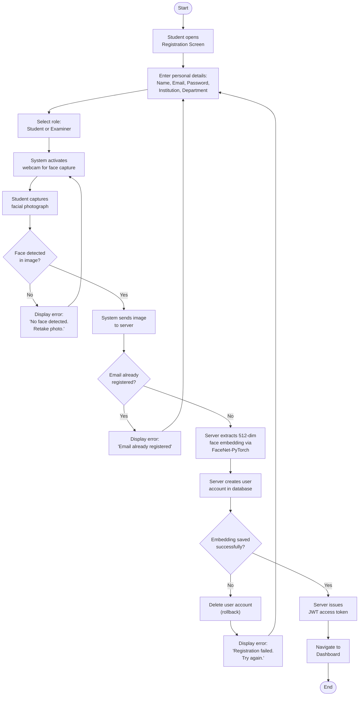

### Activity Diagram 2: Student Exam Attempt (Complete Flow)

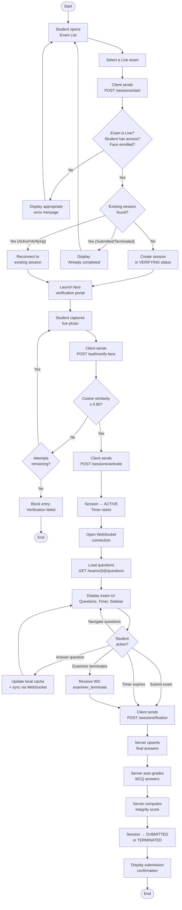

### Activity Diagram 3: Examiner Exam Creation & Lifecycle

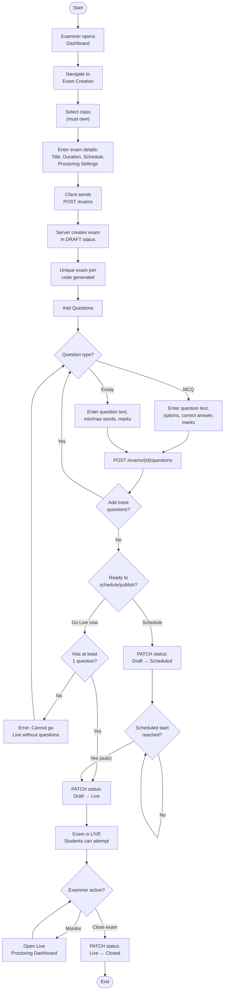

### Activity Diagram 4: Real-Time Proctoring & Violation Detection

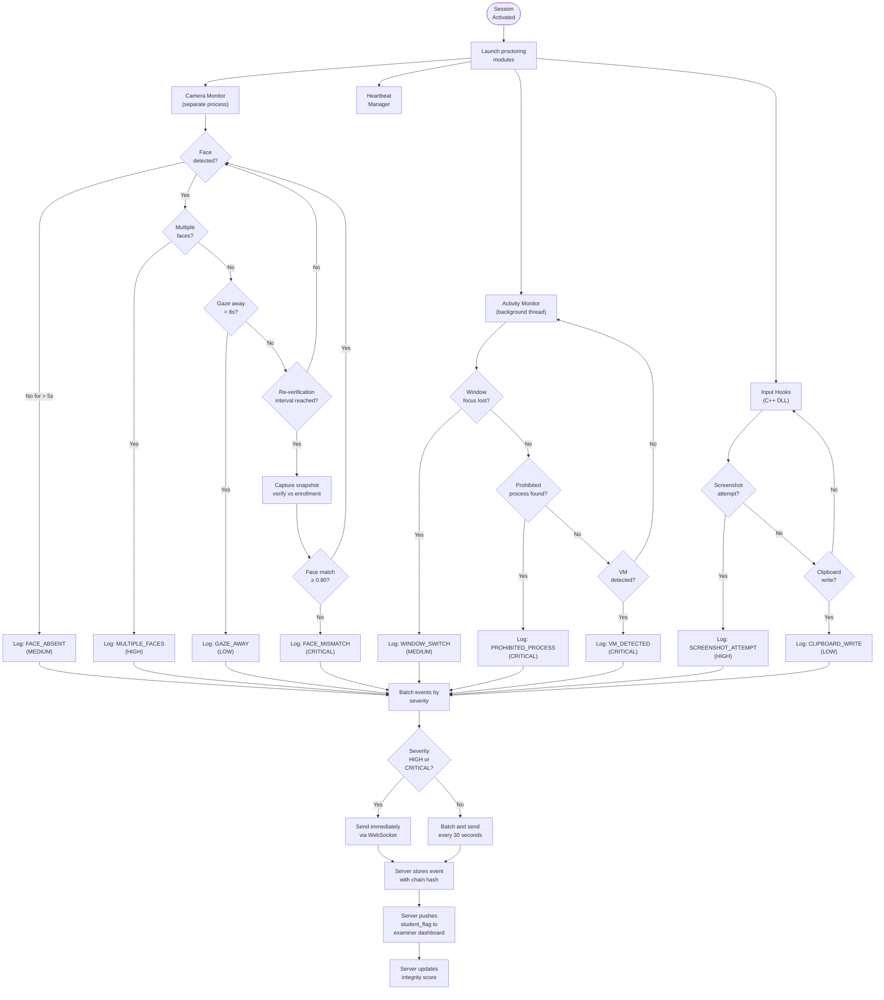

### Activity Diagram 5: Examiner Review & Grading

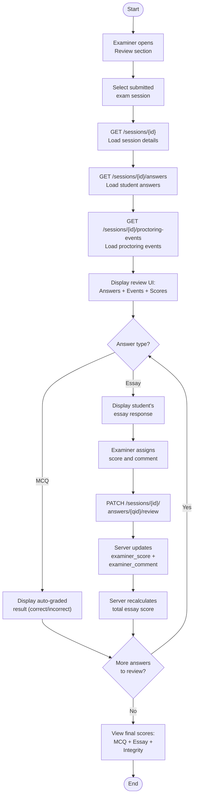

---

## 3.3 Sequence Diagrams

### Sequence Diagram 1: Student Login Flow

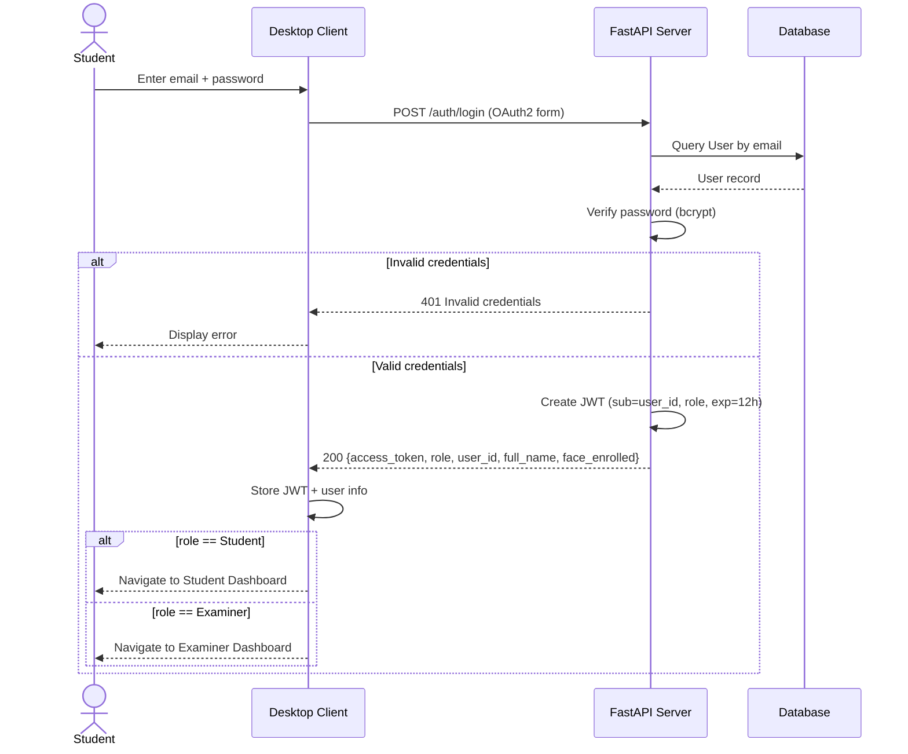

### Sequence Diagram 2: Exam Session Lifecycle (Start → Verify → Active → Submit)

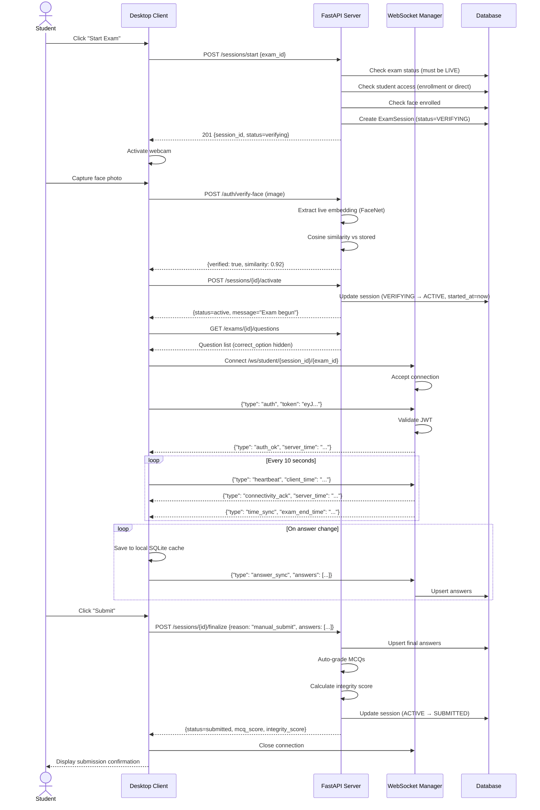

### Sequence Diagram 3: Real-Time Proctoring Event Flow

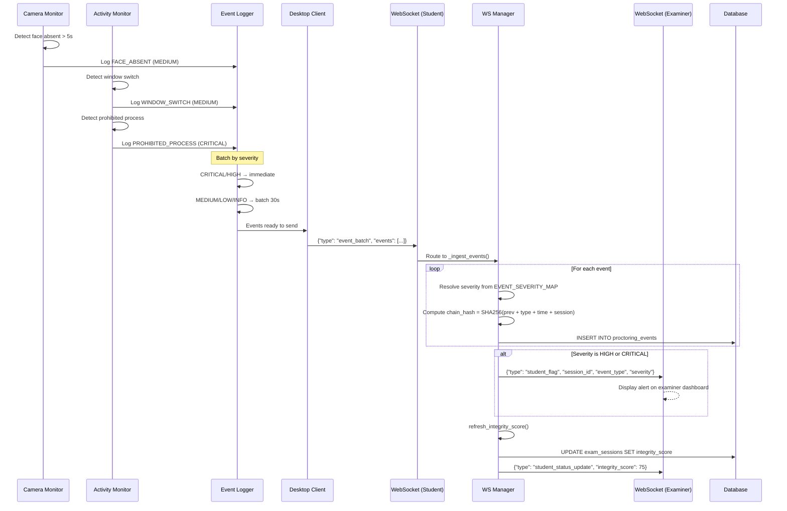

### Sequence Diagram 4: Examiner Terminates Student Session

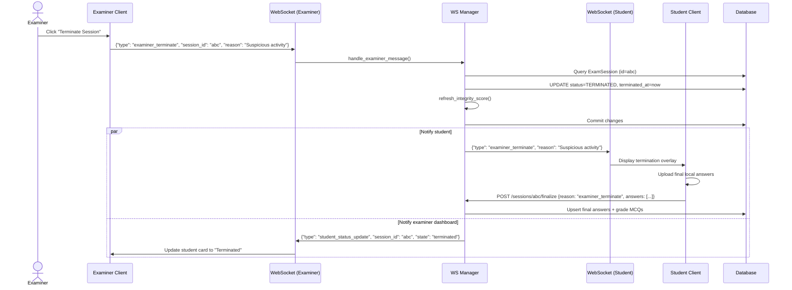

---

## 3.4 Class Diagram (UML)

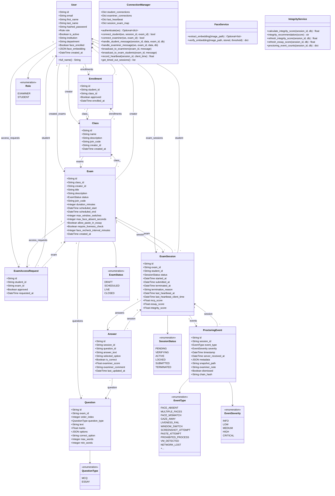

---

## 3.5 Database Design

### 3.5.1 ER Diagram

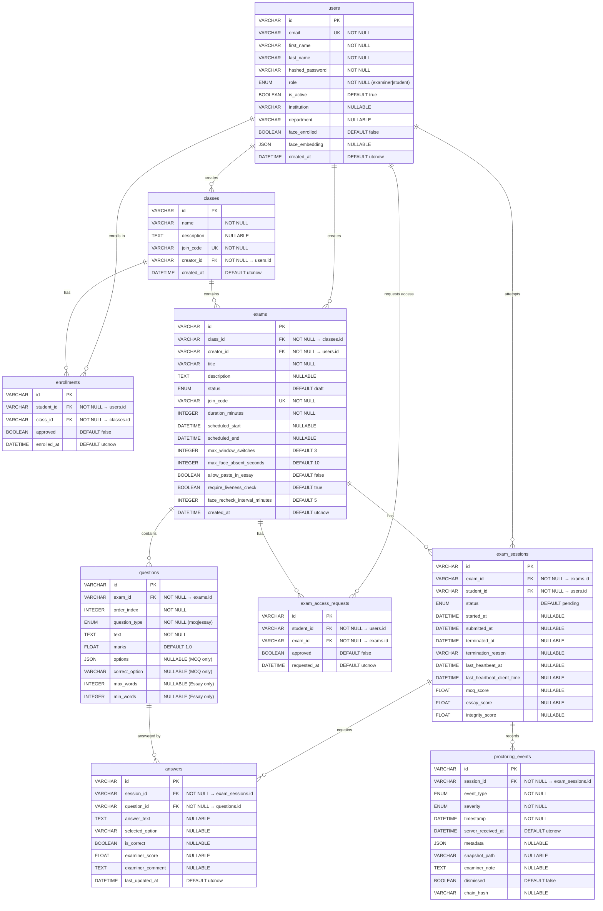

### 3.5.2 Database Schema

| Table | Column | Data Type | Constraints | Description |
|-------|--------|-----------|-------------|-------------|
| **users** | id | VARCHAR | PK, DEFAULT uuid4 | Unique user identifier |
| | email | VARCHAR | UNIQUE, NOT NULL, INDEXED | User login email |
| | first_name | VARCHAR | NOT NULL | User's first name |
| | last_name | VARCHAR | NOT NULL | User's last name |
| | hashed_password | VARCHAR | NOT NULL | Bcrypt password hash |
| | role | ENUM(Role) | NOT NULL | examiner or student |
| | is_active | BOOLEAN | DEFAULT TRUE | Account active status |
| | institution | VARCHAR | NULLABLE | University/college name |
| | department | VARCHAR | NULLABLE | Academic department |
| | face_enrolled | BOOLEAN | DEFAULT FALSE | Whether face is registered |
| | face_embedding | JSON | NULLABLE | 512-dim float vector |
| | created_at | DATETIME | DEFAULT utcnow | Registration timestamp |
| **classes** | id | VARCHAR | PK, DEFAULT uuid4 | Unique class identifier |
| | name | VARCHAR | NOT NULL | Class name |
| | description | TEXT | NULLABLE | Class description |
| | join_code | VARCHAR | UNIQUE, NOT NULL | 6-char alphanumeric code |
| | creator_id | VARCHAR | FK → users.id, NOT NULL | Examiner who created the class |
| | created_at | DATETIME | DEFAULT utcnow | Creation timestamp |
| **enrollments** | id | VARCHAR | PK, DEFAULT uuid4 | Enrollment record ID |
| | student_id | VARCHAR | FK → users.id, NOT NULL | Student who enrolled |
| | class_id | VARCHAR | FK → classes.id, NOT NULL | Target class |
| | approved | BOOLEAN | DEFAULT FALSE | Examiner approval status |
| | enrolled_at | DATETIME | DEFAULT utcnow | Request timestamp |
| **exams** | id | VARCHAR | PK, DEFAULT uuid4 | Unique exam identifier |
| | class_id | VARCHAR | FK → classes.id, NOT NULL | Parent class |
| | creator_id | VARCHAR | FK → users.id, NOT NULL | Examiner who created the exam |
| | title | VARCHAR | NOT NULL | Exam title |
| | description | TEXT | NULLABLE | Exam description |
| | status | ENUM(ExamStatus) | DEFAULT DRAFT | Lifecycle state |
| | join_code | VARCHAR | UNIQUE, NOT NULL, INDEXED | 6-char exam code |
| | duration_minutes | INTEGER | NOT NULL | Exam duration |
| | scheduled_start | DATETIME | NULLABLE | Planned start time |
| | scheduled_end | DATETIME | NULLABLE | Planned end time |
| | max_window_switches | INTEGER | DEFAULT 3 | Proctoring threshold |
| | max_face_absent_seconds | INTEGER | DEFAULT 10 | Face absence threshold |
| | allow_paste_in_essay | BOOLEAN | DEFAULT FALSE | Paste permission |
| | require_liveness_check | BOOLEAN | DEFAULT TRUE | Liveness at entry |
| | face_recheck_interval_minutes | INTEGER | DEFAULT 5 | Re-verification interval |
| | created_at | DATETIME | DEFAULT utcnow | Creation timestamp |
| **exam_access_requests** | id | VARCHAR | PK, DEFAULT uuid4 | Request record ID |
| | student_id | VARCHAR | FK → users.id, NOT NULL, INDEXED | Requesting student |
| | exam_id | VARCHAR | FK → exams.id, NOT NULL, INDEXED | Target exam |
| | approved | BOOLEAN | DEFAULT FALSE | Approval status |
| | requested_at | DATETIME | DEFAULT utcnow | Request timestamp |
| **questions** | id | VARCHAR | PK, DEFAULT uuid4 | Question identifier |
| | exam_id | VARCHAR | FK → exams.id, NOT NULL | Parent exam |
| | order_index | INTEGER | NOT NULL | Display order |
| | question_type | ENUM(QuestionType) | NOT NULL | mcq or essay |
| | text | TEXT | NOT NULL | Question body |
| | marks | FLOAT | DEFAULT 1.0 | Points value |
| | options | JSON | NULLABLE | MCQ option list |
| | correct_option | VARCHAR | NULLABLE | MCQ correct answer key |
| | max_words | INTEGER | NULLABLE | Essay max word limit |
| | min_words | INTEGER | NULLABLE | Essay min word limit |
| **exam_sessions** | id | VARCHAR | PK, DEFAULT uuid4 | Session identifier |
| | exam_id | VARCHAR | FK → exams.id, NOT NULL | Parent exam |
| | student_id | VARCHAR | FK → users.id, NOT NULL | Student taking exam |
| | status | ENUM(SessionStatus) | DEFAULT PENDING | Session lifecycle state |
| | started_at | DATETIME | NULLABLE | Timer start (on activation) |
| | submitted_at | DATETIME | NULLABLE | Submission timestamp |
| | terminated_at | DATETIME | NULLABLE | Termination timestamp |
| | termination_reason | VARCHAR | NULLABLE | Why terminated |
| | last_heartbeat_at | DATETIME | NULLABLE | Last server heartbeat |
| | last_heartbeat_client_time | DATETIME | NULLABLE | Last client time |
| | mcq_score | FLOAT | NULLABLE | Auto-graded MCQ score |
| | essay_score | FLOAT | NULLABLE | Examiner-graded essay score |
| | integrity_score | FLOAT | NULLABLE | Computed integrity score |
| **answers** | id | VARCHAR | PK, DEFAULT uuid4 | Answer identifier |
| | session_id | VARCHAR | FK → exam_sessions.id, NOT NULL | Parent session |
| | question_id | VARCHAR | FK → questions.id, NOT NULL | Answered question |
| | answer_text | TEXT | NULLABLE | Essay answer text |
| | selected_option | VARCHAR | NULLABLE | MCQ selected option |
| | is_correct | BOOLEAN | NULLABLE | Auto-graded correctness |
| | examiner_score | FLOAT | NULLABLE | Manual essay score |
| | examiner_comment | TEXT | NULLABLE | Examiner feedback |
| | last_updated_at | DATETIME | DEFAULT utcnow | Last modification |
| **proctoring_events** | id | VARCHAR | PK, DEFAULT uuid4 | Event identifier |
| | session_id | VARCHAR | FK → exam_sessions.id, NOT NULL | Parent session |
| | event_type | ENUM(EventType) | NOT NULL | Violation category |
| | severity | ENUM(EventSeverity) | NOT NULL | Severity level |
| | timestamp | DATETIME | NOT NULL | Client-side event time |
| | server_received_at | DATETIME | DEFAULT utcnow | Server receipt time |
| | metadata | JSON | NULLABLE | Additional event data |
| | snapshot_path | VARCHAR | NULLABLE | Path to captured frame |
| | examiner_note | TEXT | NULLABLE | Examiner annotation |
| | dismissed | BOOLEAN | DEFAULT FALSE | Event dismissed by examiner |
| | chain_hash | VARCHAR | NULLABLE | SHA-256 chain hash |

### 3.5.3 Relationships

| Relationship | Type | Description |
|-------------|------|-------------|
| users → classes | One-to-Many | One examiner can create many classes |
| users → enrollments | One-to-Many | One student can enroll in many classes |
| users → exams | One-to-Many | One examiner can create many exams |
| users → exam_sessions | One-to-Many | One student can have many exam sessions |
| users → exam_access_requests | One-to-Many | One student can request access to many exams |
| classes → enrollments | One-to-Many | One class can have many enrollment requests |
| classes → exams | One-to-Many | One class can contain many exams |
| exams → questions | One-to-Many | One exam can have many questions |
| exams → exam_sessions | One-to-Many | One exam can have many student sessions |
| exams → exam_access_requests | One-to-Many | One exam can have many access requests |
| exam_sessions → answers | One-to-Many | One session can contain many answers |
| exam_sessions → proctoring_events | One-to-Many | One session can record many proctoring events |
| questions → answers | One-to-Many | One question can be answered by many sessions |

---

## 3.6 UI/UX Mockups / Wireframes

### Screen Flow Navigation Diagram

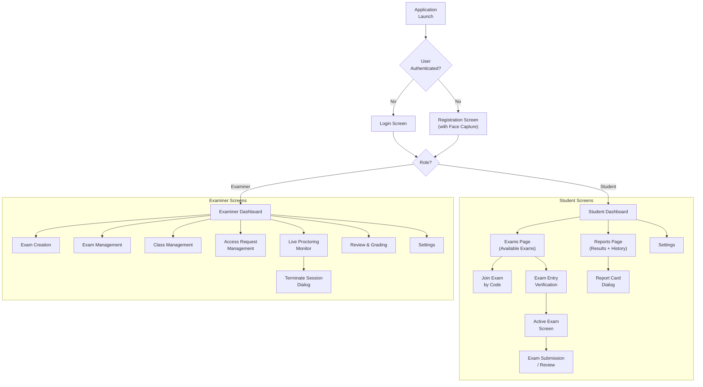

### Screen Descriptions

The following screens constitute the ExamApp user interface. Screenshots shall be inserted during final report assembly.

**[INSERT SCREENSHOT: Login Screen]**
The login screen provides email and password fields with a modern, dark-themed card-based design. A role indicator displays whether the user is logging in as a Student or Examiner. The screen includes a link to the registration page.

**[INSERT SCREENSHOT: Registration Screen with Face Capture]**
The registration screen features a multi-field form (first name, last name, email, password, institution, department, role selection) alongside a live webcam preview panel. Users capture their facial photograph using an integrated camera widget. The captured image is validated for face detection before submission.

**[INSERT SCREENSHOT: Student Dashboard]**
The student dashboard displays a sidebar navigation (Dashboard, Exams, Reports, Settings), a "Next Exam" hero card showing the upcoming assessment, a quick statistics panel (exams taken, average score, integrity rating), upcoming assessments list, and recent results cards.

**[INSERT SCREENSHOT: Student Exams Page]**
The exams page features a list of available exams grouped by status (Live, Scheduled, Draft), a "Join by Code" widget for entering exam join codes, and a pending requests panel showing access requests awaiting examiner approval.

**[INSERT SCREENSHOT: Exam Entry Verification]**
A full-screen overlay showing the webcam feed with a face detection bounding box. The student must capture a clear facial photograph that is verified against their enrollment embedding. A progress indicator and retry mechanism are displayed.

**[INSERT SCREENSHOT: Active Exam Screen]**
The exam-taking interface includes: a top bar with exam title, timer countdown, and submission button; a left sidebar with question navigation tiles (numbered, colour-coded by answered/unanswered status); and a central question area displaying either MCQ radio buttons or an essay text editor with word counter.

**[INSERT SCREENSHOT: Exam Submission / Review Screen]**
A review overlay that displays a summary of all answers before final submission. Questions are listed with their answered/unanswered status, allowing students to navigate back to any question before confirming submission.

**[INSERT SCREENSHOT: Student Reports Page]**
The reports page displays a sidebar, a statistics panel (total exams, average score, average integrity), and a scrollable results list with exam titles, dates, scores, and grade status indicators. Each result can be expanded into a detailed report card dialog.

**[INSERT SCREENSHOT: Report Card Dialog]**
A modal dialog showing detailed score breakdown: MCQ score, essay score, total score, maximum marks, integrity score with recommendation label, and per-question answer review.

**[INSERT SCREENSHOT: Examiner Dashboard]**
The examiner dashboard includes a metrics overview section (total exams, active sessions, pending requests), an exam management section with cards for each exam (showing status, student count, scheduled time), and a live alert feed streaming real-time proctoring events from active exams.

**[INSERT SCREENSHOT: Exam Creation Screen]**
A form-based screen for creating exams with fields for title, description, duration, scheduled start/end, and proctoring configuration sliders (max window switches, face absence threshold, liveness check toggle, paste permission, re-verification interval). Below the form, a question builder section allows adding MCQ and Essay questions.

**[INSERT SCREENSHOT: Live Proctoring Monitor]**
A real-time monitoring dashboard connected via WebSocket. Displays connected student sessions as cards with status indicators, integrity scores, and latest proctoring events. Provides examiner controls for pausing the exam, ending the exam, and terminating individual sessions.

**[INSERT SCREENSHOT: Examiner Review & Grading Screen]**
A review interface displaying student answers side-by-side with question text. MCQ answers show auto-graded correctness. Essay answers include a scoring input and comment field for manual grading. A proctoring events timeline is accessible for integrity assessment.

**[INSERT SCREENSHOT: Class Management Screen]**
A management interface for creating classes, viewing join codes, and processing pending enrollment requests (approve/reject).

**[INSERT SCREENSHOT: Settings Screen]**
An application settings panel with communication settings (server URL, port configuration), display preferences, and account management options.

---

## 3.7 System Architecture Diagram

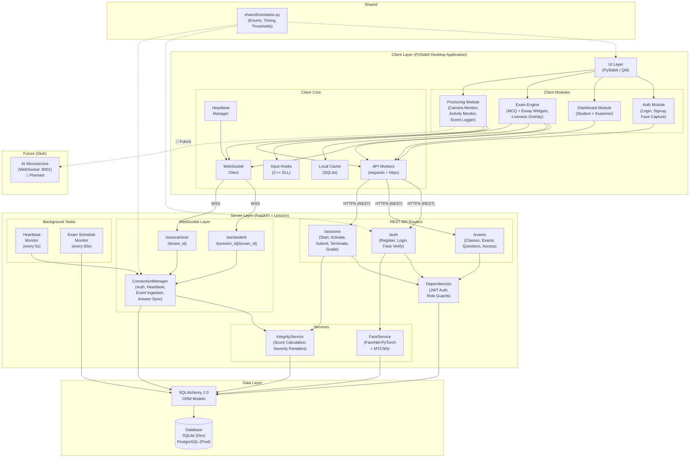

---

## 3.8 Data Flow Diagrams (DFDs)

### Level-0 DFD (Context Diagram)

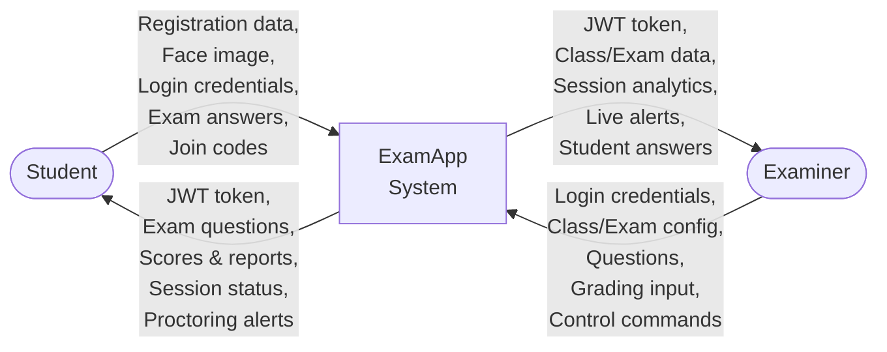

### Level-1 DFD

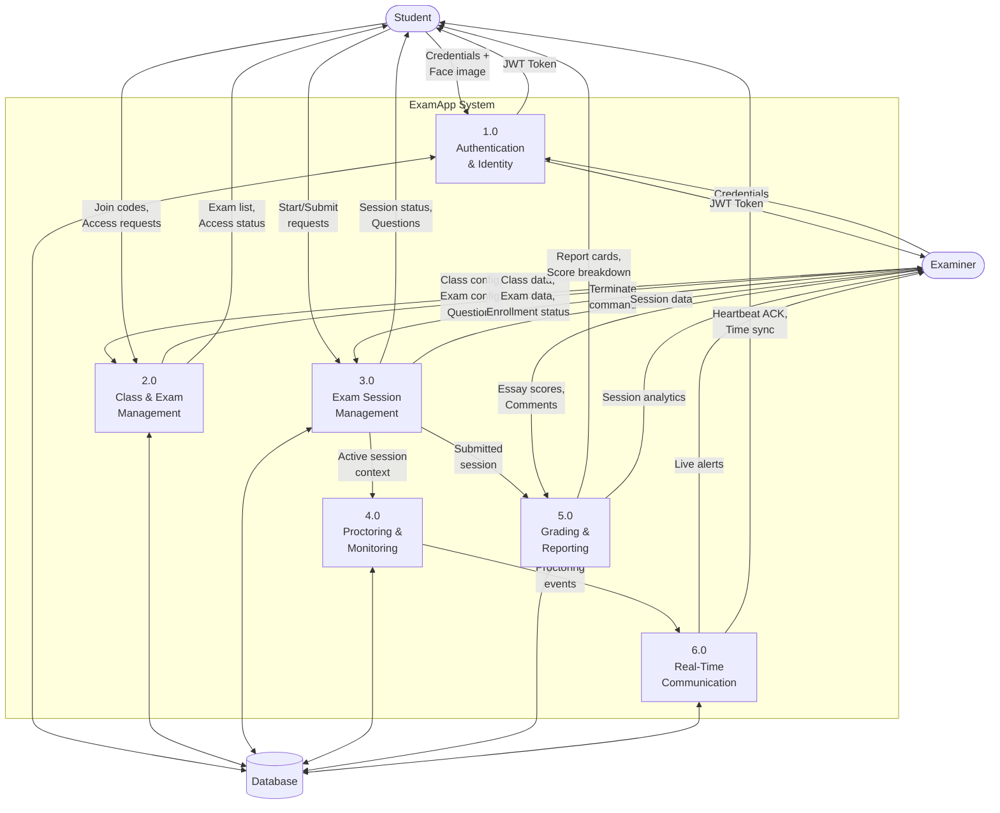

---

# Section 4: Implementation

## 4.1 Development Environment

The development of the ExamApp platform utilized a modern technology stack divided into three primary tiers: a desktop client, a backend server, and a database layer. The environment was designed to support cross-platform development while optimizing for a Windows-native deployment for the examination client.

### 4.1.1 Technology Stack

**Frontend (Desktop Client):**
*   **Language:** Python 3.10+
*   **Framework:** PySide6 (Qt6 for Python) 6.7.0
*   **Architecture:** Component-based UI with centralized routing and encrypted local SQLite caching.
*   **Native Integration:** C++ DLL (`input_hooks.dll`) compiled via CMake for low-level Windows API keyboard/mouse event hooking.

**Backend (Server & API):**
*   **Language:** Python 3.10+
*   **Framework:** FastAPI 0.111.0
*   **Server:** Uvicorn 0.29.0
*   **Real-time Communication:** `websockets` 12.0 for bi-directional event streaming and connection management.
*   **Authentication:** `python-jose` for JWT handling, `passlib` with `bcrypt` for secure password hashing.

**Proctoring & AI Services:**
*   **Face Recognition:** `facenet-pytorch` 2.5.3 (incorporating MTCNN for face detection and FaceNet for feature extraction).
*   **Computer Vision:** `opencv-python` 4.9.0 and `mediapipe` 0.10.14 for liveness and gaze tracking.
*   **System Monitoring:** `psutil` 5.9.8 and `pywin32` 306 for process scanning, window focus detection, and clipboard monitoring.

**Database Layer:**
*   **ORM:** SQLAlchemy 2.0.30
*   **Database Engine:** SQLite (utilized for development and local testing), with architecture ready for PostgreSQL in production deployment.
*   **Migrations:** Alembic (planned for schema versioning).

### 4.1.2 Environment Setup

The setup process was containerized at the environment level using Python virtual environments to ensure dependency isolation between the client and server components.

**Server Setup:**
1.  A dedicated virtual environment was initialized in the `server/` directory.
2.  Dependencies were installed via `pip install -r requirements.txt`.
3.  Environment variables (including database credentials and JWT secret keys) were configured in a local `.env` file based on a provided `.env.example` template.
4.  The FastAPI application was launched using the Uvicorn ASGI server with hot-reloading enabled for development (`uvicorn server.main:app --host 0.0.0.0 --port 8000 --reload`).

**Client Setup:**
1.  A separate virtual environment was created in the `client/` directory.
2.  Dependencies for PySide6, OpenCV, and native interaction libraries were installed.
3.  The client application was executed via the Python module execution standard (`python -m client.main`).

---

## 4.2 User Interface Screenshots

The graphical user interface (GUI) was engineered to provide an intuitive, distinct experience for both the Student and Examiner roles. The interface emphasizes modern design principles, utilizing a dark-themed aesthetic with borderless windows, distinct typography, and smooth transitions managed by a central router (`MainWindow`). 

The following subsections describe the primary screens of the application.

### 4.2.1 Authentication Module

**[INSERT SCREENSHOT: Login Screen]**
*Description:* The initial access point of the application. It features a streamlined, centered authentication card over a dark background. It contains input fields for email and password, a prominent "Login" button, and a role indicator that dynamically reflects whether the user is authenticating as a Student or an Examiner. A navigation link is provided to route new users to the registration workflow.

**[INSERT SCREENSHOT: Registration Screen with Face Capture]**
*Description:* A comprehensive onboarding screen divided into two main panels. The left panel contains a data entry form capturing first name, last name, email, password, institution, department, and role selection. The right panel embeds a live webcam preview widget. This widget is utilized for mandatory facial capture during Student registration, ensuring that a valid baseline face embedding is registered with the backend system before the account is finalized.

### 4.2.2 Student Workflows

**[INSERT SCREENSHOT: Student Dashboard]**
*Description:* The central hub for a logged-in student. The layout incorporates a persistent left-hand sidebar for navigation (Dashboard, Exams, Reports, Settings). The main view area features a "Next Exam" hero card detailing the most imminent assessment. Below this, a metrics panel displays aggregate statistics (e.g., total exams taken, average score, average integrity rating), alongside a list of upcoming assessments and recent exam results.

**[INSERT SCREENSHOT: Student Exam List]**
*Description:* This screen enumerates all exams to which the student has access. Exams are categorized by their current lifecycle status (Live, Scheduled, Draft). A dedicated "Join by Code" widget allows students to request access to new exams via a unique 6-character alphanumeric code. A side panel displays the status of any pending exam or class access requests awaiting examiner approval.

**[INSERT SCREENSHOT: Exam Entry Verification]**
*Description:* A full-screen, high-security overlay presented immediately before entering a live exam session. It displays a live camera feed augmented with a face-detection bounding box. The student must capture a photograph that the AI microservice compares against their initial enrollment embedding. The exam session is only activated if the cosine similarity score meets the strict ≥ 0.80 threshold.

**[INSERT SCREENSHOT: Active Exam Screen]**
*Description:* The primary assessment interface, designed to minimize distractions. 
*   **Header:** Displays the exam title, a live countdown timer, and a final "Submit" button.
*   **Sidebar:** Provides a grid of question navigation tiles. These tiles are numbered and color-coded to indicate whether a question has been answered or remains pending.
*   **Main Content Area:** Renders the active question. For Multiple-Choice Questions (MCQs), it presents radio buttons; for Essay questions, it provides a rich text editor equipped with a real-time word counter.
*   **Proctoring:** Invisible to the student, background threads continuously monitor liveness, window focus, and hardware inputs.

**[INSERT SCREENSHOT: Exam Submission / Review Screen]**
*Description:* A pre-submission confirmation overlay. It presents a comprehensive summary of the exam attempt, explicitly listing all questions and highlighting any that remain unanswered. This screen allows the student to navigate back to specific questions to finalize their answers before committing the irreversible final submission.

**[INSERT SCREENSHOT: Student Reports Page]**
*Description:* A historical record of the student's academic performance. It features a top-level statistics summary and a scrollable list of completed exam sessions. Each entry details the exam title, submission date, total score, and a grade status indicator. 

**[INSERT SCREENSHOT: Report Card Dialog]**
*Description:* Accessed from the Reports Page, this modal dialog provides an in-depth breakdown of a specific exam attempt. It visually separates the auto-graded MCQ score from the manually graded Essay score. Crucially, it displays the session's computed Integrity Score alongside an automated recommendation label (e.g., "Clear", "Review Recommended"). A per-question breakdown is also available for detailed feedback.

### 4.2.3 Examiner Workflows

**[INSERT SCREENSHOT: Examiner Dashboard]**
*Description:* The command center for the examiner. It provides a macro-level overview of their academic ecosystem. Metrics cards display the total number of managed exams, currently active student sessions, and pending enrollment requests. An active feed section streams real-time alerts from ongoing live exams, prioritizing high-severity proctoring events.

**[INSERT SCREENSHOT: Exam Creation Screen]**
*Description:* A robust administrative interface for constructing new assessments. 
*   **Configuration Form:** Captures exam metadata (title, description, scheduled start/end times, total duration).
*   **Proctoring Settings:** A suite of toggles and sliders allowing the examiner to enforce specific security policies (e.g., max permitted window switches, maximum face absence duration in seconds, requiring entry liveness checks, and allowing paste functionality in essays).
*   **Question Builder:** An interactive section to dynamically append, edit, or remove MCQ and Essay questions from the exam draft.

**[INSERT SCREENSHOT: Live Proctoring Monitor]**
*Description:* A real-time surveillance dashboard connected directly to the backend via WebSockets. It visualizes all currently connected student sessions for a specific live exam as individual cards. Each card displays the student's name, current session status, live integrity score, and the most recent proctoring violation. The interface provides critical examiner controls, including the ability to pause the entire exam or unilaterally terminate a specific student's session in cases of severe academic misconduct.

**[INSERT SCREENSHOT: Examiner Review & Grading Screen]**
*Description:* The interface utilized post-exam for manual evaluation. It displays the student's submitted answers side-by-side with the original question text. While MCQs display their auto-graded status (correct/incorrect), Essay answers present a dedicated scoring input field and a rich text area for qualitative examiner feedback. A chronological timeline of all proctoring events recorded during that student's session is presented alongside the answers to inform grading decisions.

**[INSERT SCREENSHOT: Class Management Screen]**
*Description:* An administrative panel for managing student cohorts. It allows the examiner to create new classes, retrieve generated join codes, and process (approve or reject) pending enrollment requests from students attempting to join their classes.

**[INSERT SCREENSHOT: Settings Screen]**
*Description:* A globally accessible panel for configuring application-wide parameters. It includes network communication settings (server URL, port overriding), display preferences, and account management options (e.g., logging out).

---

# Section 5: Testing & Quality Assurance

## 5.1 Test Strategy

Ensuring the reliability, security, and stability of the ExamApp platform was paramount given its application in high-stakes assessment environments. The testing strategy employed a comprehensive, multi-tiered approach, prioritizing End-to-End (E2E) testing to validate the complex integration between the desktop client, backend API, and real-time WebSocket communication channels.

The primary methodologies utilized were:

1.  **End-to-End (E2E) Testing (Automated):** Utilized `pytest` in conjunction with `pytest-qt` to simulate real user interactions within the PySide6 desktop client while concurrently communicating with a live, local instance of the FastAPI backend. This validated the complete data lifecycle from UI click, to local caching, to database persistence.
2.  **In-Process Integration Testing:** A custom asynchronous harness (`e2e_exam_flow_check.py`) was developed to validate state transitions and WebSocket messaging (e.g., heartbeats, answer synchronization, and proctoring event ingestion) without the overhead of full UI rendering, allowing for rapid regression testing.
3.  **Resilience & Fault Injection Testing:** Specific scenarios were designed to simulate edge cases, such as network dropouts (to verify the offline lockdown and local cache recovery mechanisms) and biometric verification failures (to ensure the application fails gracefully without crashing).

**Testing Frameworks & Tools:**
*   `pytest` (Test runner and assertion framework)
*   `pytest-qt` (Qt event loop integration for UI testing)
*   `requests` (Synchronous API interaction simulation)
*   `asyncio` (WebSocket and concurrency simulation)

## 5.2 Test Cases

The following table details the primary test cases executed against the ExamApp platform, derived directly from the automated test suites.

| Test ID | Description | Input / Trigger | Expected Output | Actual Output | Status |
| :--- | :--- | :--- | :--- | :--- | :--- |
| **TC-01** | **Examiner Exam Creation Flow** | Examiner authenticates, creates a Class, creates an Exam (with proctoring rules), adds MCQ & Essay questions, and publishes the exam. | HTTP 201/200 responses. Exam state transitions from `DRAFT` to `LIVE`. Join code is generated. | HTTP 201/200 received. Exam state is `LIVE`. | **Pass** |
| **TC-02** | **Student Check-In & Liveness Success** | Student requests access via join code. Examiner approves. Student initiates exam and passes simulated liveness check. | Access request approved. Session transitions `PENDING` → `VERIFYING` → `ACTIVE`. UI renders exam view. | Session `ACTIVE`. Exam window renders successfully. | **Pass** |
| **TC-03** | **Liveness Verification Failure** | Student initiates exam. Camera/Liveness mock returns a timeout/failure (e.g., no blink detected). | UI displays `InfoDialog` detailing the failure. Application does *not* crash. Session transitions to `TERMINATED`. | Dialog displayed. App remains stable. Session `TERMINATED`. | **Pass** |
| **TC-04** | **Real-Time Answer Synchronization** | Student selects an MCQ option and inputs text into an Essay field. | Answers are immediately saved to the encrypted local cache and synced via the WebSocket `ANSWER_SYNC` event. | Local SQLite updated. Database `answers` table upserted. | **Pass** |
| **TC-05** | **Network Disconnect & Recovery** | Manually trigger a WebSocket disconnect event during an active exam session. | Client initiates lockdown overlay. Local caching remains active. Upon reconnection, overlay lifts and offline answers sync. | Lockdown triggered. Cache preserved. Sync successful on reconnect. | **Pass** |
| **TC-06** | **Real-Time Proctoring Alerts** | Student client simulates a proctoring violation (e.g., `MULTIPLE_FACES` detected). | Event batched and sent via WebSocket. Server computes severity. Examiner WebSocket receives a `STUDENT_FLAG` message. | Event persisted. Examiner receives high-severity flag. | **Pass** |
| **TC-07** | **Examiner Forced Termination** | Examiner triggers a session termination command for a specific active student. | Server updates session to `TERMINATED`. Student receives WebSocket `EXAMINER_TERMINATE` signal, forcing a final sync and closing the exam UI. | Session terminated in DB. Student UI locked and closed. | **Pass** |
| **TC-08** | **Session Reconnection** | Student closes the application during an `ACTIVE` session and restarts it. | System identifies the existing session, bypasses liveness (if within threshold), and resumes the exam timer and state. | Session resumed seamlessly from existing state. | **Pass** |
| **TC-09** | **Normal Exam Submission** | Student clicks "Submit" manually or timer expires. | Client sends `finalize` request with remaining cached answers. Server auto-grades MCQs. Session transitions to `SUBMITTED`. | Final answers saved. MCQ graded accurately. Session `SUBMITTED`. | **Pass** |

---

# Section 6: Conclusion & Future Work

## 6.1 Summary of Achievements

The development of the ExamApp platform successfully culminated in a robust, secure, and modern desktop examination system. The project achieved its primary aim of addressing the critical vulnerabilities present in traditional, browser-based online assessment tools. 

Key technical and functional achievements include:
*   **Dual-Workflow Architecture:** Successfully implemented distinct, secure workflows for both Students and Examiners within a single, cohesive application framework.
*   **Advanced Proctoring Engine:** Integrated a multi-layered security model combining biometric facial verification (FaceNet/MTCNN), native OS-level hardware monitoring (C++ hooks), and real-time behavioral analysis.
*   **Resilient Session Management:** Engineered a fault-tolerant session lifecycle that utilizes encrypted local SQLite caching to preserve student data during network interruptions, seamlessly synchronizing via WebSockets upon reconnection.
*   **Real-Time Data Streaming:** Deployed a high-performance WebSocket architecture that enables examiners to monitor live student feeds, receive immediate proctoring alerts, and unilaterally control session states (pause, terminate) with sub-second latency.
*   **Performance Optimizations:** Implemented complex resource management strategies, such as adaptive camera framerates, severity-based event batching, and two-process camera architecture, to minimize the CPU and memory footprint on student machines.

## 6.2 Challenges Faced

The creation of a desktop-native application interacting with a real-time web backend presented several significant engineering hurdles:

*   **Concurrency & Thread Safety in PySide6:** Managing asynchronous network tasks (via `websockets` and `asyncio`) alongside the synchronous Qt event loop required complex thread delegation to prevent the user interface from freezing during prolonged API calls or heavy local cache writes.
*   **Cross-Process Communication:** The proctoring module required isolating the computationally expensive computer vision tasks (MediaPipe, OpenCV) into separate processes to ensure the exam interface remained responsive. Safely passing video frames and liveness signals between these processes without inducing memory leaks proved challenging.
*   **Native OS Integration (Windows API):** Developing the C++ DLL (`input_hooks.dll`) to intercept system-level keyboard shortcuts (e.g., Alt+Tab, PrintScreen) required navigating the undocumented complexities of the Win32 API, ensuring hooks were applied securely without triggering false positives from localized antivirus software.
*   **Biometric False Positives:** Tuning the cosine similarity threshold (initially set to 0.80) for the FaceNet embeddings required careful balancing. If set too high, varied lighting conditions caused legitimate students to fail entry verification; if set too low, the system risked vulnerability to impersonation.
*   **State Reconciliation:** Ensuring the local SQLite cache and the PostgreSQL backend remained perfectly synchronized during intermittent network outages demanded a robust delta-sync algorithm that could handle out-of-order WebSocket packet delivery.

## 6.3 Lessons Learned

The iterative development lifecycle of this project yielded profound insights into both technical architecture and project management:

*   **Security vs. Usability:** Implementing stringent proctoring measures (such as network lockdown overlays and rapid process scanning) often directly competes with user experience. Designing graceful failure states (e.g., allowing students to continue typing an essay offline rather than crashing the exam) was a critical lesson in user-centric security design.
*   **Asynchronous State Management:** Dealing with real-time, bidirectional data flows reinforced the absolute necessity of maintaining a single source of truth (the backend `ConnectionManager`) while carefully handling optimistic UI updates on the client side.
*   **The Value of Modular Design:** Decoupling the proctoring logic from the core exam engine allowed for the isolated development and optimization of the camera monitoring tools without breaking the fundamental question-rendering components.

## 6.4 Future Enhancements

While the current iteration of ExamApp fulfills its core requirements, several areas have been identified for future expansion to prepare the platform for commercial-scale deployment:

1.  **AI Microservice Integration:** Transition the current AI processing (face detection, liveness) from running locally on the student's machine to a dedicated, scalable GPU-accelerated microservice. This will lower the minimum hardware requirements for the desktop client.
2.  **Advanced Hardware Anti-Cheat:** Enhance the C++ native hooks to include CPUID instruction checks to actively detect if the application is running within a Virtual Machine (VM), and implement system-wide clipboard locking during active sessions.
3.  **Security Hardening:** 
    *   Transition all backend communications from HTTP/WS to HTTPS/WSS with self-signed TLS certificate generation for secure LAN deployments.
    *   Implement rate-limiting on authentication endpoints to prevent brute-force attacks.
    *   Enforce strict server-side file type and file size validation on all image uploads.
    *   Integrate SQLCipher to fully encrypt the local SQLite cache at rest.
4.  **Cross-Platform Expansion:** Port the PySide6 UI to support macOS and Linux environments, acknowledging the diverse operating systems utilized in modern academic settings.
5.  **Automated Packaging:** Implement automated build pipelines using PyInstaller and InnoSetup (or NSIS) to generate a seamless, one-click Windows installer executable for end-users.
6.  **Granular Essay Validation:** Introduce robust server-side input validation and sanitization (stripping HTML/script tags) for essay submissions to prevent potential injection vulnerabilities if answers are later rendered in web-based administrative dashboards.

---

