# Section 1: Introduction

## 1.1 Background
The shift toward digital assessment has transformed higher education, offering flexibility but introducing vulnerabilities like academic dishonesty. Existing solutions, mostly browser-based, lack operating system-level access to reliably enforce security, creating an operational gap. ExamApp bridges this gap by providing a secure, desktop-native examination platform with AI-assisted proctoring and real-time monitoring.

## 1.2 Problem Statement
Existing online examination platforms suffer from critical shortcomings:
1. **Insufficient Security Enforcement:** Browser-based tools cannot reliably detect system-level violations.
2. **Lack of Real-Time Identity Verification:** Continuous verification during exams is rarely implemented.
3. **Poor Examiner Visibility:** Examiners lack real-time insights into student behavior during live exams.
4. **Fragile Session Management:** Network disruptions often cause data loss.
5. **Limited Assessment Flexibility:** Mixed-format (MCQ + Essay) assessments are poorly supported.

## 1.3 Aim & Objectives
**Aim:** To develop ExamApp, a secure desktop examination platform for conducting proctored assessments with real-time monitoring, AI-assisted identity verification, and robust session management.
**Objectives:**
- Develop a role-based authentication system with facial biometric enrollment.
- Implement comprehensive exam lifecycle management (Draft → Scheduled → Live → Closed).
- Build a desktop-native environment that enforces OS-level integrity controls via a custom C++ hook DLL.
- Integrate AI-assisted proctoring (MediaPipe, FaceNet) for continuous identity and liveness verification.
- Design a real-time communication layer using WebSockets for live monitoring.
- Develop a resilient session management system with encrypted local caching.
- Create reporting modules for detailed grading and integrity analytics.

## 1.4 Scope & Limitations
**Scope:** Covers User Management, Exam Lifecycle Management, a Secure Exam Environment, Real-Time Communication, Session Reconnection, Grading, and Reporting.
**Limitations:** Windows only; no web/mobile client; AI runs locally rather than via a microservice; development database is SQLite; plain HTTP/WS (no TLS currently).

## 1.5 Motivation
Existing proctoring solutions impose high costs and privacy concerns by sharing biometric data with third parties, while open-source alternatives lack system-level security. ExamApp was built to provide a secure, self-hosted, and cost-effective alternative while offering an extensive learning opportunity in full-stack desktop development, real-time networking, and computer vision.

---

# Section 2: Methodology (Software Process Model)

## 2.1 Development Life Cycle Selected
The **Iterative and Incremental Development Model** was chosen. This allowed for continuous integration and testing of core modules (e.g., integrating the Python UI with the native C++ hooks and WebSocket backend), mitigating technical risks early and adapting to evolving requirements.

### Iterative Development Lifecycle Diagram
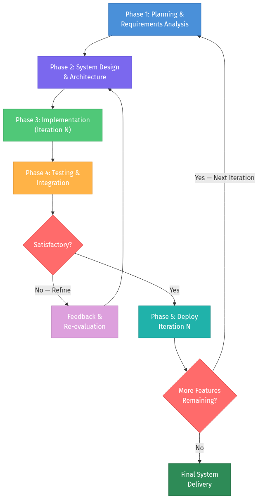

## 2.2 Requirement Engineering

### 2.2.1 Functional Requirements (Core)
- **FR-01:** System shall support Role-based Authentication (Student/Examiner) with facial enrollment.
- **FR-02:** Examiners can create Classes and manage Exam Lifecycles.
- **FR-03:** Students can join exams and undergo liveness/identity verification before entry.
- **FR-04:** The client must sync answers in real-time via WebSockets and cache them locally.
- **FR-05:** Examiners must be able to view live proctoring events and terminate sessions remotely.

### 2.2.2 Non-Functional Requirements (Core)
- **Performance:** Adaptive camera frame rates (10 FPS active, 2 FPS idle) to reduce CPU usage.
- **Security:** Use of bcrypt for passwords, JWTs for sessions, and a custom native DLL to intercept keyboard/mouse events.
- **Reliability:** Support seamless reconnection to active sessions without data loss after network drops.

## 2.3 System Feasibility Analysis
- **Technical Feasibility:** Python (FastAPI, PySide6) combined with SQLite/PostgreSQL, MediaPipe, and a C++ DLL handles all requirements natively.
- **Operational Feasibility:** Deploys internally on institutional infrastructure; desktop clients install on student machines.
- **Economic Feasibility:** Built entirely on open-source frameworks (LGPL/MIT), eliminating recurring licensing costs.

## 2.4 Tools & Environment Setup
- **Backend:** Python 3.10+, FastAPI, Uvicorn, SQLAlchemy, SQLite/PostgreSQL, `websockets`, `python-jose`, `passlib`.
- **Frontend & Native:** PySide6 (Qt6), `requests`, `cryptography`, `psutil`, C++ custom `input_hooks.dll`.
- **AI/Vision:** `facenet-pytorch`, `opencv-python`, `mediapipe`.

---

# Section 3: System Analysis & Design

## 3.1 Use Case Diagram & Descriptions

### Use Case Diagram
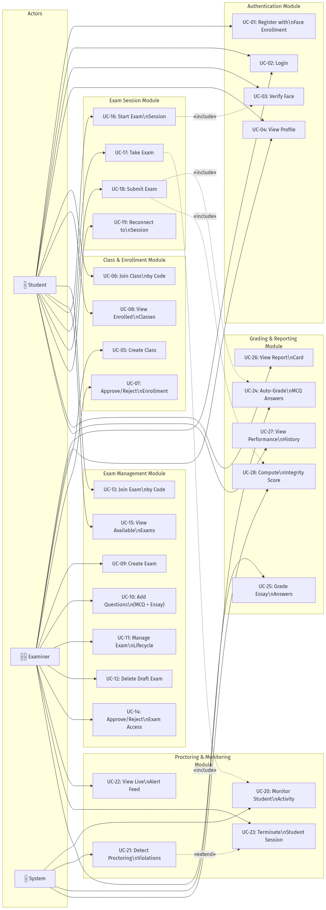

### Key Workflows
- **UC-01 (Register & Face Enroll):** Users provide details and capture a webcam photo. The system extracts a 512-dim embedding for future identity checks.
- **UC-09 (Manage Exam Lifecycle):** Examiners create and transition exams through Draft → Scheduled → Live → Closed states.
- **UC-16 (Start Exam Session):** Students verify their identity via a live webcam feed against their stored embedding before entering the exam.
- **UC-20 (Monitor Activity):** Background processes monitor face presence, gaze, window switches, and system events, streaming violations to examiners in real time.

## 3.2 Activity Diagrams

### Student Registration & Face Enrollment
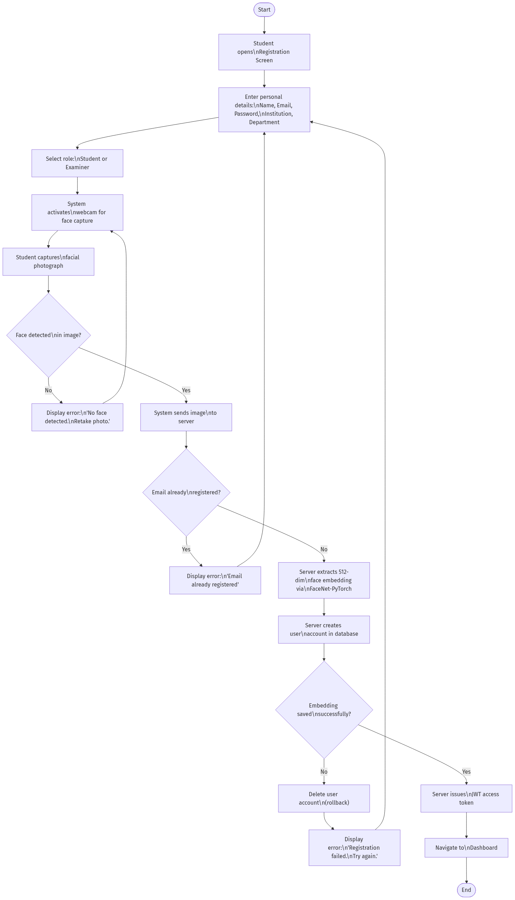

### Student Exam Attempt (Complete Flow)
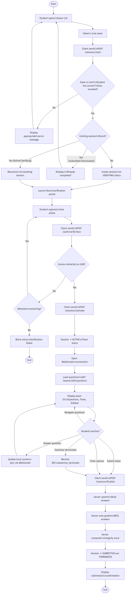

### Examiner Exam Creation & Lifecycle
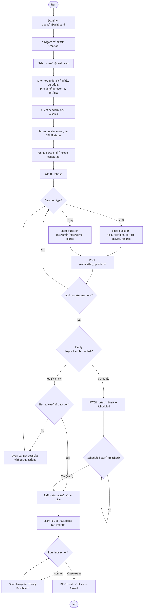

### Real-Time Proctoring & Violation Detection
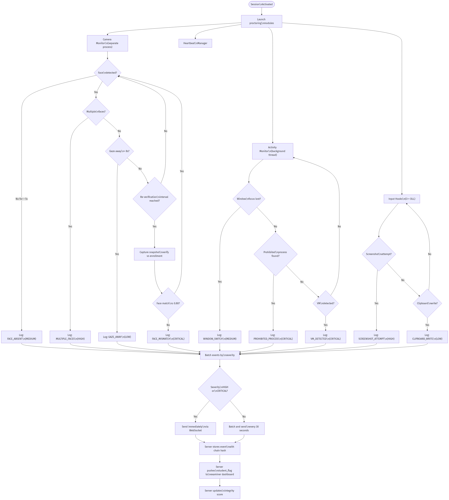

### Examiner Review & Grading
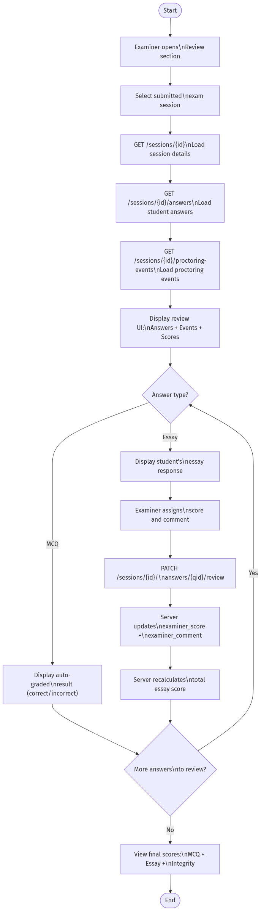

## 3.3 Sequence Diagrams

### Student Login Flow
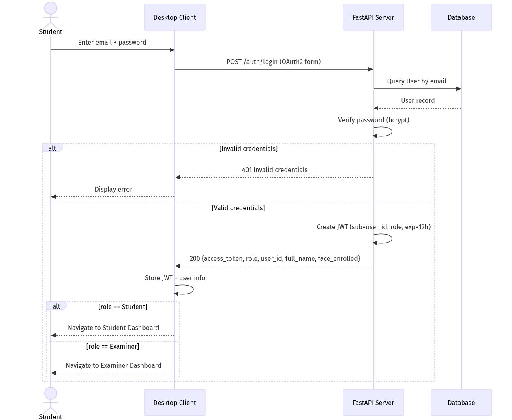

### Exam Session Lifecycle
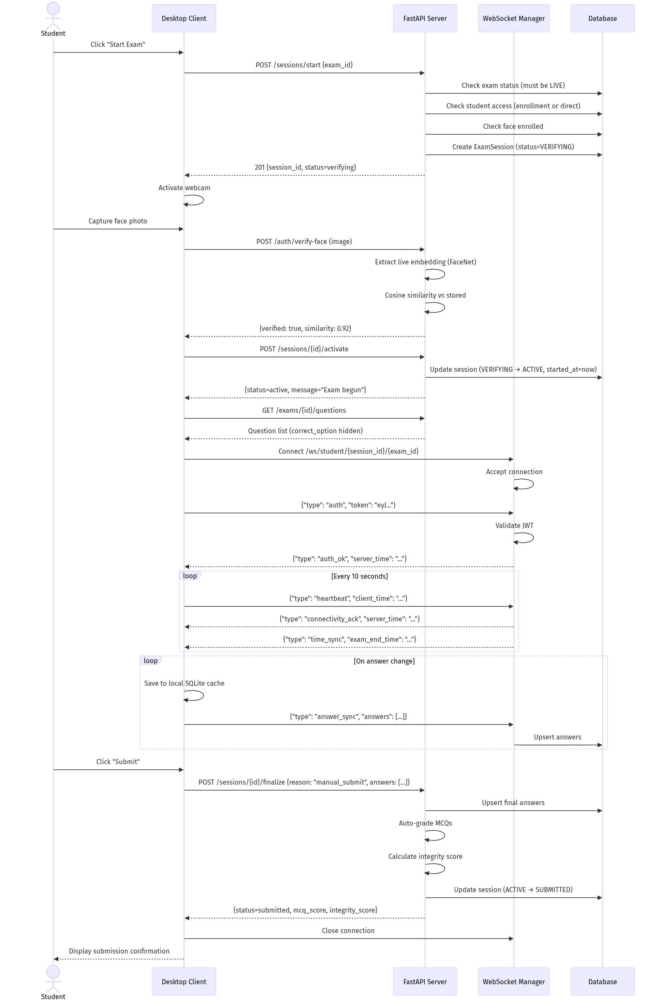

### Real-Time Proctoring Event Flow
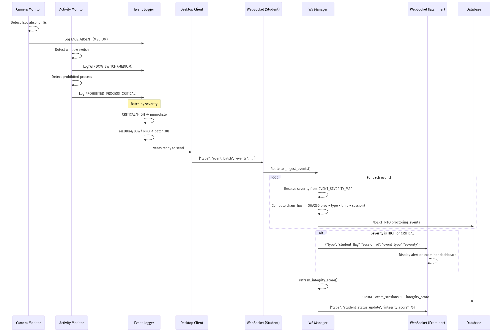

### Examiner Terminates Student Session
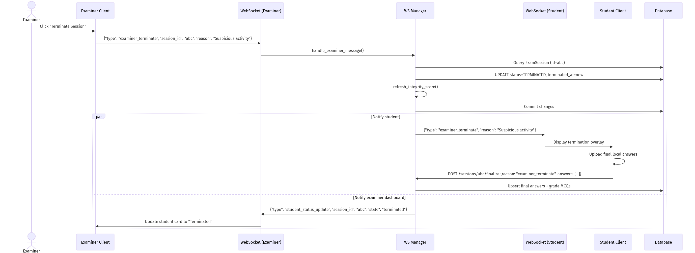

## 3.4 Class Diagram (UML)
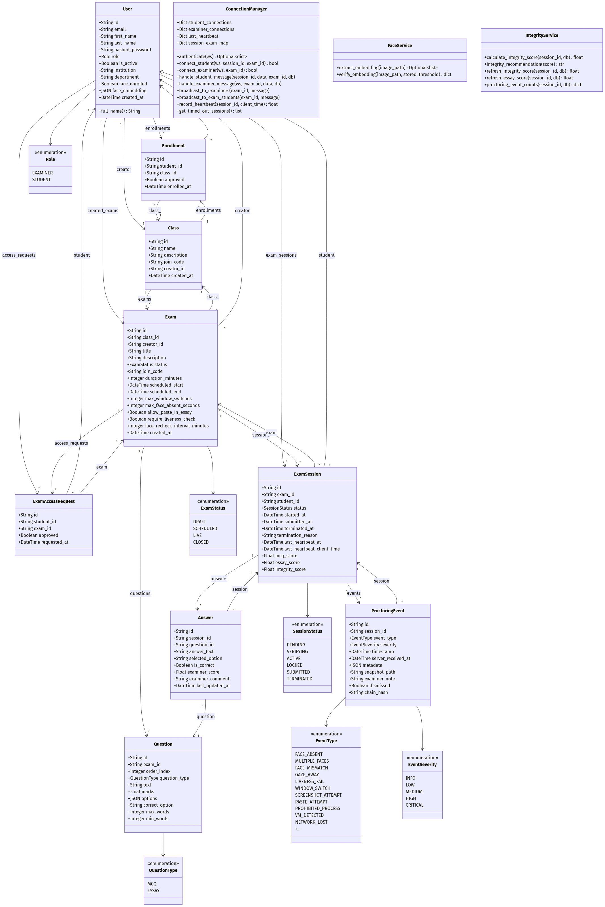

## 3.5 Database Design

### ER Diagram
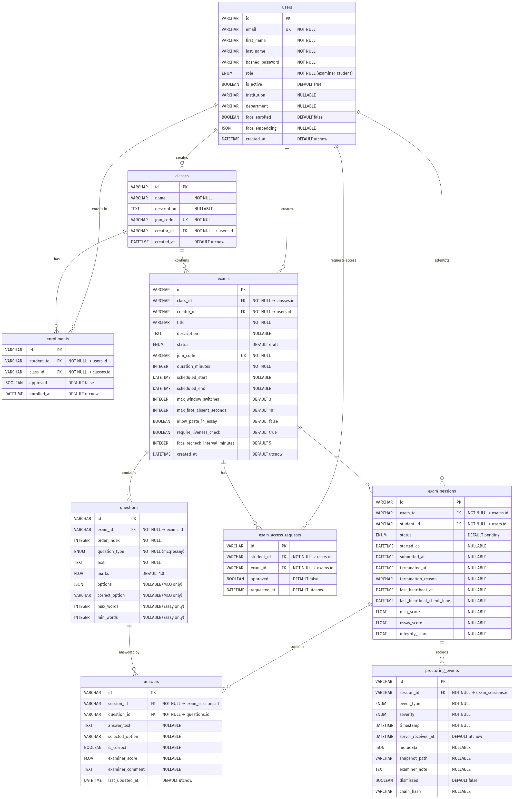

### Core Schema Overview
The database relies on several core tables:
- **`users`**: Stores authentication details, roles, and biometric embeddings.
- **`classes` & `exams`**: Represents hierarchical grouping of exams and their lifecycle configurations.
- **`questions` & `answers`**: Stores assessment content and student responses.
- **`exam_sessions`**: Tracks student progression through an exam, including grades and integrity scores.
- **`proctoring_events`**: Logs integrity violations linked to specific sessions.

## 3.6 UI/UX Mockups / Wireframes
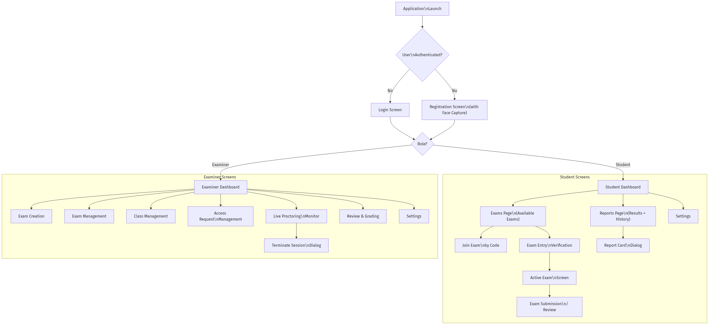

*(Screenshots to be placed inline in Section 4.2)*

## 3.7 System Architecture Diagram
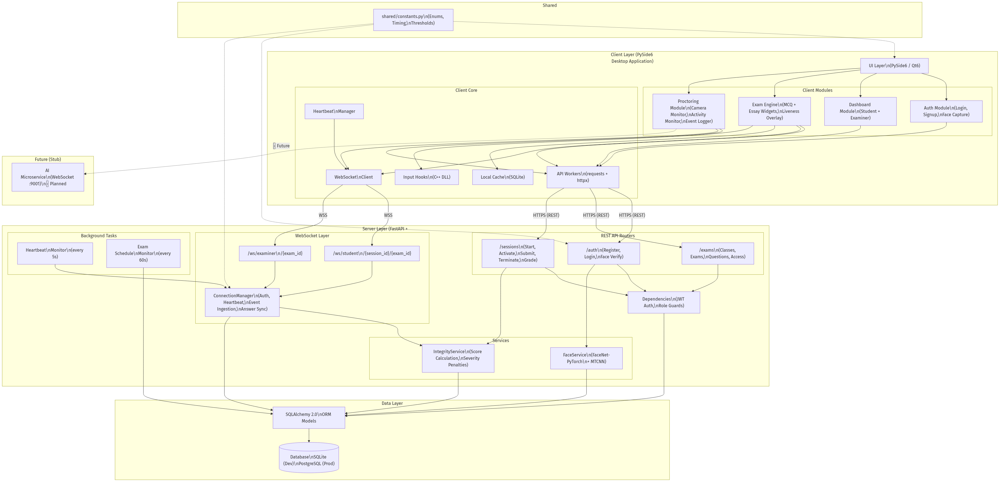

## 3.8 Data Flow Diagrams (DFDs)

### Level-0 DFD (Context Diagram)
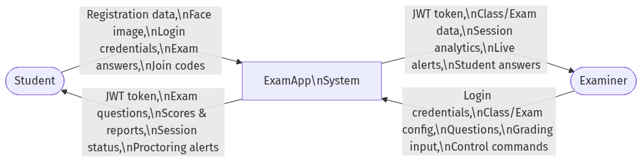

### Level-1 DFD
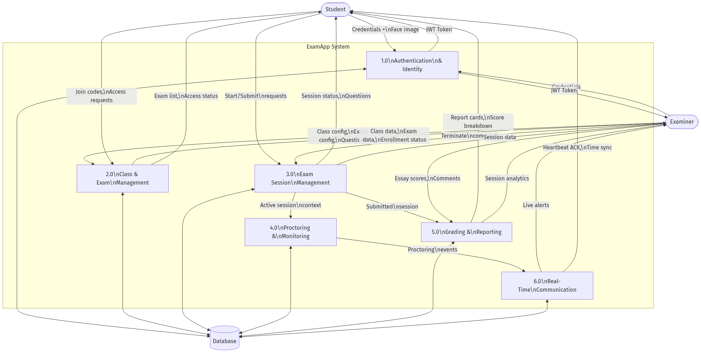

---

# Section 4: Implementation

## 4.1 Development Environment
The application is structured into a desktop client (PySide6) and a backend server (FastAPI). 
- **Server:** Runs in an isolated virtual environment, exposing REST endpoints and WebSocket channels for real-time data sync.
- **Client:** A Windows-native executable that uses a two-process architecture to isolate AI facial processing from the main UI thread, ensuring smooth performance. It leverages a compiled C++ DLL to enforce strict keyboard/mouse hooks during active exams.

## 4.2 User Interface Screenshots
*(Note: Visuals to be inserted during document assembly)*

1. **Authentication & Dashboard:** The dark-themed UI provides distinct dashboards for Students (showing upcoming exams) and Examiners (showing active exams and metrics).
2. **Exam Entry Verification:** A critical overlay enforcing biometric checks before entering an exam.
3. **Active Exam View:** A distraction-free interface featuring a timer, navigation sidebar, and answer inputs. It syncs answers continuously via WebSockets.
4. **Live Proctoring Monitor:** The Examiner's view of all active student sessions, displaying live integrity scores and incoming violation events.
5. **Review & Grading:** Interface for examiners to score essay questions alongside an event timeline to assess a student's integrity.

---

# Section 5: Testing & Quality Assurance

## 5.1 Test Strategy
Testing prioritized End-to-End (E2E) flows validating the integration of the PySide6 UI, the FastAPI backend, and WebSocket streams using `pytest` and `pytest-qt`. Fault injection tests verified offline caching resilience.

## 5.2 Key Test Cases

| Test ID | Description | Expected Output | Status |
|---|---|---|---|
| **TC-01** | **Create & Publish Exam:** Examiner creates exam, adds questions, and makes it Live. | Exam state transitions to `LIVE` successfully. | Pass |
| **TC-02** | **Student Check-In:** Student verifies identity via liveness check to enter exam. | Session becomes `ACTIVE` and timer starts. | Pass |
| **TC-03** | **Liveness Failure:** Simulation of failed face detection during entry. | UI blocks entry, session terminates without crashing. | Pass |
| **TC-04** | **Offline Resilience:** Disconnect network during exam, reconnect after 30s. | Local cache saves answers; syncs perfectly on reconnect. | Pass |
| **TC-05** | **Proctoring Flag:** Student switches windows; event is logged. | Examiner dashboard receives high-severity WebSocket alert. | Pass |
| **TC-06** | **Remote Termination:** Examiner unilaterally ends student session. | Student UI immediately locks and closes the session. | Pass |

---

# Section 6: Conclusion & Future Work

## 6.1 Summary of Achievements
ExamApp successfully delivered a secure, desktop-native assessment tool. It implements robust dual-workflow authentication, real-time proctoring via computer vision and system-level hooks, and a fault-tolerant session manager capable of handling network drops without data loss.

## 6.2 Challenges Faced
- **Concurrency in UI:** Balancing asynchronous WebSocket tasks with the synchronous Qt event loop required precise thread management.
- **Process Isolation:** Offloading MediaPipe processing to background threads prevented the UI from freezing but complicated cross-process memory management.
- **Native OS Hooks:** Capturing Windows-level events safely without triggering antivirus software required extensive tuning.

## 6.3 Lessons Learned
- **Security vs. Usability:** Strict anti-cheat measures must be balanced with graceful offline failure states to prevent punishing students for genuine network instability.
- **Single Source of Truth:** Relying on the server's WebSocket manager as the authoritative state handler was essential to prevent client/server desynchronization.

## 6.4 Future Enhancements
1. **AI Microservice:** Shift local facial processing to a centralized GPU-accelerated server to lower client hardware requirements.
2. **Advanced Hardware Checks:** Add VM detection (CPUID) and system-wide clipboard locks.
3. **Security Hardening:** Implement end-to-end TLS/WSS encryption and SQLCipher for local data at rest.
4. **Cross-Platform Support:** Port the application to macOS and Linux using Qt6’s cross-platform capabilities.
