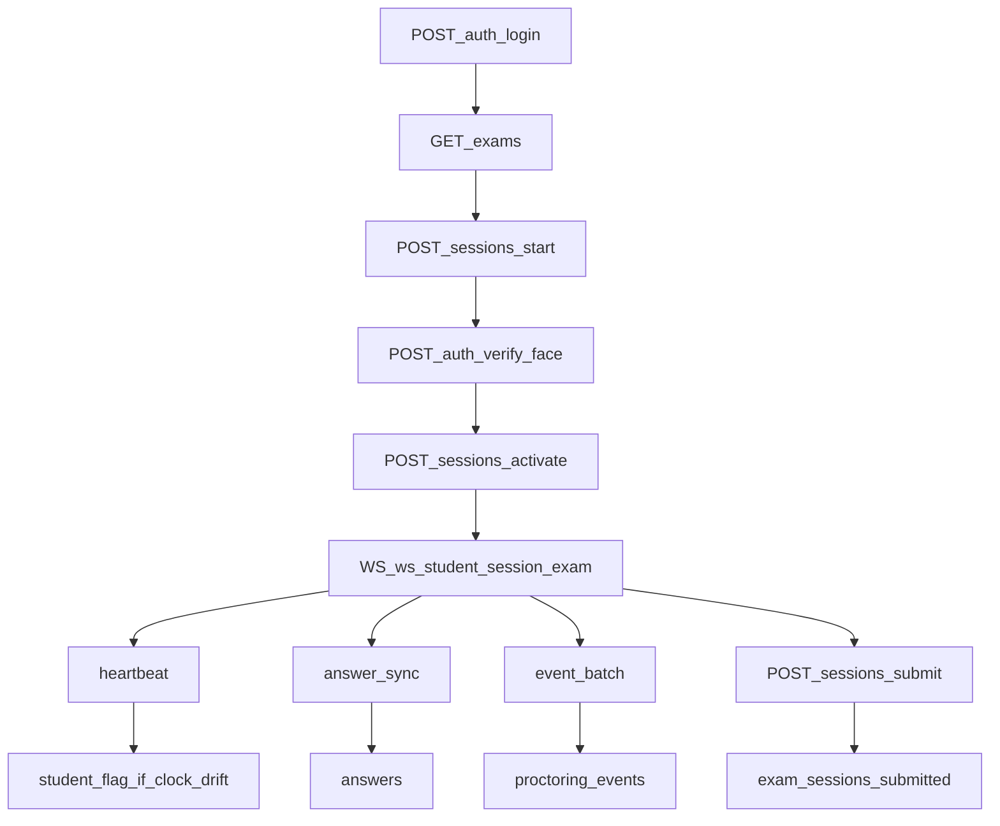
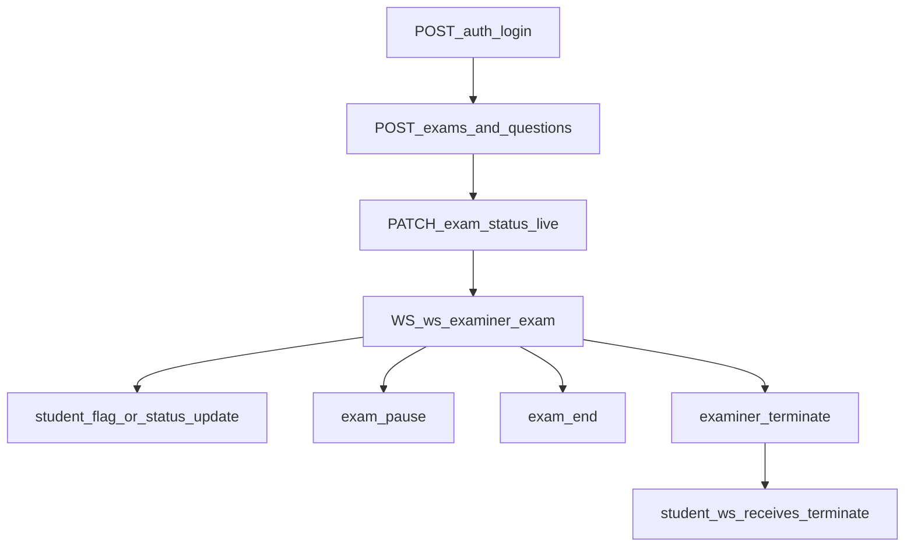

# Client Backend Contract (Source of Truth)

This document is generated from backend implementation code and is intended to be the canonical integration reference for the PyQt6 client.

Primary sources:
- `server/models/models.py`
- `server/routers/auth.py`
- `server/routers/exams.py`
- `server/routers/sessions.py`
- `server/main.py`
- `server/websocket/manager.py`
- `shared/constants.py`

## 1) Canonical Enums and Shared Types

From `shared/constants.py`:
- `Role`: `examiner`, `student`
- `ExamStatus`: `draft`, `scheduled`, `live`, `closed`
- `SessionStatus`: `pending`, `verifying`, `active`, `locked`, `submitted`, `terminated`
- `QuestionType`: `mcq`, `essay`
- `EventSeverity`: `info`, `low`, `medium`, `high`, `critical`
- `WSMessageType`:
  - Server -> client: `exam_start`, `exam_pause`, `exam_end`, `time_sync`, `examiner_terminate`, `connectivity_ack`
  - Client -> server: `heartbeat`, `event_batch`, `answer_sync`, `session_state`
  - Dashboard stream: `student_flag`, `student_status_update`

Timing constants used/defined:
- `HEARTBEAT_INTERVAL_SECONDS = 10`
- `HEARTBEAT_TIMEOUT_SECONDS = 15`
- `NETWORK_LOCKDOWN_DURATION_SECONDS = 120` (defined, currently not enforced in backend logic)

## 2) Database Schema Map

From `server/models/models.py`.

### `users`
- Identity: `id`, `email` (unique)
- Profile: `first_name`, `last_name`, `institution`, `department`
- Auth: `hashed_password`, `role`, `is_active`
- Face: `face_enrolled`, `face_embedding` (JSON list, embedding vector)
- Audit: `created_at`

### `classes`
- `id`, `name`, `description`, `join_code` (unique), `creator_id`, `created_at`

### `enrollments`
- `id`, `student_id`, `class_id`, `approved`, `enrolled_at`

### `exams`
- Identity/ownership: `id`, `class_id`, `creator_id`
- Metadata: `title`, `description`, `status`, `duration_minutes`, `scheduled_start`, `scheduled_end`
- Proctoring config:
  - `max_window_switches`
  - `max_face_absent_seconds`
  - `allow_paste_in_essay`
  - `require_liveness_check`
  - `face_recheck_interval_minutes`
- Audit: `created_at`

### `questions`
- `id`, `exam_id`, `order_index`, `question_type`, `text`, `marks`
- MCQ: `options` (JSON list), `correct_option`
- Essay: `max_words`, `min_words`

### `exam_sessions`
- Keys: `id`, `exam_id`, `student_id`, `status`
- Timeline: `started_at`, `submitted_at`, `terminated_at`, `termination_reason`
- Connectivity fields: `last_heartbeat_at`, `last_heartbeat_client_time`
- Scores: `mcq_score`, `essay_score`, `integrity_score`

### `answers`
- `id`, `session_id`, `question_id`
- Content: `answer_text`, `selected_option`
- Grading: `is_correct`, `examiner_score`
- Audit: `last_updated_at`

### `proctoring_events`
- `id`, `session_id`, `event_type`, `severity`, `timestamp`, `server_received_at`
- Extra payload: `metadata` (JSON), `snapshot_path`, `examiner_note`, `dismissed`
- Tamper evidence: `chain_hash`

## 3) REST API Contracts (Observed from Code)

Auth prefix: `/auth`

### Auth Routes
- `POST /auth/register-with-face` (multipart form)
  - Inputs: `email`, `first_name`, `last_name`, `password`, `role`, `institution`, `department`, `image`
  - Success: `201` with `{ user_id, access_token, message }`
  - Notes: validates face before user creation; deletes user if embedding save fails.
- `POST /auth/login` (OAuth2 form: username/password)
  - Success: `{ access_token, token_type, role, user_id, full_name, face_enrolled }`
- `POST /auth/enroll-face` (multipart file, auth required)
  - Success: `{ message, embedding_dims }`
- `POST /auth/verify-face` (multipart file, auth required)
  - Success: `{ verified, similarity, distance }`
- `GET /auth/me` (auth required)
  - Success: profile object with identity and face enrollment flags.

### Class and Exam Routes
- `POST /classes` (examiner)
- `GET /classes` (examiner)
- `GET /classes/enrolled` (student)
- `POST /classes/join-by-code/{code}` (student)
- `POST /classes/{class_id}/enroll` (student)
- `PUT /classes/{class_id}/enrollments/{enrollment_id}/approve` (examiner owner)
- `PUT /classes/{class_id}/enrollments/{enrollment_id}/reject` (examiner owner)
- `GET /classes/{class_id}/enrollments` (examiner owner)
- `POST /exams` (examiner owner of class)
- `GET /exams` (student, optional `class_id`)
- `GET /exams/{exam_id}` (authenticated user)
- `PATCH /exams/{exam_id}/status` (examiner owner)
- `POST /exams/{exam_id}/questions` (examiner owner, exam must be `draft`)
- `GET /exams/{exam_id}/questions` (authenticated user; `correct_option` hidden for students)
- `DELETE /exams/{exam_id}/questions/{question_id}` (examiner owner, exam must be `draft`)

### Session Routes
- `POST /sessions/start` (student)
  - Preconditions: exam must be `live`; approved enrollment; face enrolled.
  - Creates session in `verifying`.
- `POST /sessions/{session_id}/activate` (student owner)
  - `verifying -> active`.
- `POST /sessions/{session_id}/submit` (student owner)
  - Allowed statuses: `active` or `locked`.
  - Auto-grades MCQ and sets `submitted`.
- `GET /sessions/my-performance` (student)
- `GET /sessions/my-history` (student)
- `GET /sessions/{session_id}` (student owner or any examiner)
- `GET /sessions/{session_id}/answers` (student owner or any examiner)
- `GET /exams/{exam_id}/sessions` (examiner owner)
- `POST /sessions/{session_id}/terminate` (examiner)

## 4) WebSocket Contract and Data Effects

WebSocket endpoints:
- Student channel: `/ws/student/{session_id}/{exam_id}`
- Examiner channel: `/ws/examiner/{exam_id}`

Handshake pattern (both):
1. WS connect accepted.
2. First message within 10s must be:
   - `{ "type": "auth", "token": "<JWT>" }`
3. On success, server returns `auth_ok`.
4. Then normal bidirectional messaging starts.

Student message handling (`handle_student_message`):
- `heartbeat`
  - updates in-memory heartbeat map
  - computes client-server drift
  - drift > 30s triggers examiner `student_flag`
  - returns `connectivity_ack` to student
- `event_batch`
  - persists events in `proctoring_events`
  - computes chain hash per event
  - high/critical events push `student_flag` to examiner sockets
- `answer_sync`
  - upserts into `answers`
- `session_state`
  - pushes `student_status_update` to examiner sockets

Examiner message handling (`handle_examiner_message`):
- `examiner_terminate`
  - sends terminate message to target student socket
- `exam_pause`
  - broadcasts to all connected student sockets for that exam
- `exam_end`
  - broadcasts to all connected student sockets for that exam

Important implementation detail:
- WS heartbeat state is tracked in memory (`ConnectionManager.last_heartbeat`), not persisted to `exam_sessions.last_heartbeat_at`.

## 5) Data Flow Maps

### Student exam attempt flow

### Examiner monitoring/control flow

## 6) Discrepancies and Backend Fix List

This section captures discrepancies between implementation and expected secure behavior for client integration.

### Must-fix (backend)
1. Student WS auth does not bind token user to session owner.
   - Current: any authenticated token can connect to `/ws/student/{session_id}/{exam_id}` if session exists.
   - Risk: unauthorized socket control/monitoring.
   - Fix: after JWT decode, verify `payload.sub == ExamSession.student_id`; verify session status/ownership again.

2. Examiner terminate endpoint is not scoped to exam ownership.
   - Current: `POST /sessions/{session_id}/terminate` requires examiner role but does not verify that examiner owns the target exam.
   - Risk: one examiner can terminate sessions of another examiner's exam.
   - Fix: join `ExamSession -> Exam` and enforce `Exam.creator_id == current_user.id`.

3. Examiner WS connection is not scoped to exam ownership.
   - Current: role check only (`role == examiner`), no ownership check for `exam_id`.
   - Risk: examiner can subscribe to another examiner's live exam feed.
   - Fix: DB check in `/ws/examiner/{exam_id}` or manager connection path.

### Should-fix (backend consistency and client safety)
1. `exam_sessions` heartbeat columns are not updated.
   - Current: heartbeat only in memory map.
   - Impact: DB forensic timeline incomplete; reconnect analysis weaker.
   - Fix: update `last_heartbeat_at` and `last_heartbeat_client_time` on heartbeat ingest.

2. `NETWORK_LOCKDOWN_DURATION_SECONDS` is defined but not enforced server-side.
   - Current: no automatic `locked -> terminated` flow from timeout monitor.
   - Impact: behavior depends entirely on client and socket connectivity.
   - Fix: implement state transition and timeout enforcement in monitor.

3. Face threshold constants conflict.
   - Current: `shared.constants.FACE_MATCH_THRESHOLD = 0.6`, but `verify_embedding(... threshold=0.80)` default is used by `/auth/verify-face`.
   - Impact: client assumptions can diverge from server truth.
   - Fix: centralize threshold in one config source and import it.

4. Analysis doc endpoint mismatch.
   - Current implementation includes routes not represented in old analysis (e.g., class enrollment set, session analytics endpoints, `/sessions/{id}/activate`).
   - Impact: client built on stale contract can miss required flows.
   - Fix: use this document as canonical, retire stale assumptions.

5. Potential overexposure in read routes.
   - Current: `GET /exams/{exam_id}` and `GET /exams/{exam_id}/questions` allow any authenticated user, not only enrolled student or owner examiner.
   - Impact: exam metadata/question visibility outside class membership.
   - Fix: enforce role-aware ownership/enrollment checks.

## 7) PyQt6 Screen/Window Map

These windows are mapped directly to the current backend contract.

### Student app windows
1. `StudentLoginWindow`
   - Calls: `POST /auth/login`
   - Stores JWT and basic profile.

2. `StudentRegistrationWindow`
   - Calls: `POST /auth/register-with-face` (multipart with image capture/upload).

3. `StudentClassJoinWindow`
   - Calls: `POST /classes/join-by-code/{code}` and optional `POST /classes/{class_id}/enroll`.

4. `StudentClassEnrollmentStatusWindow`
   - Calls: `GET /classes/enrolled`.

5. `StudentExamListWindow`
   - Calls: `GET /exams` (optionally filtered by class).

6. `ExamEntryVerificationWindow`
   - Calls: `POST /sessions/start`, then `POST /auth/verify-face`, then `POST /sessions/{session_id}/activate`.

7. `ExamWindow` (MCQ + Essay)
   - Calls: `GET /exams/{exam_id}/questions`
   - WS: `/ws/student/{session_id}/{exam_id}`
   - Sends: `heartbeat`, `answer_sync`, `event_batch`, `session_state`
   - Handles: `connectivity_ack`, `exam_pause`, `exam_end`, `examiner_terminate`.

8. `SubmissionWindow`
   - Calls: `POST /sessions/{session_id}/submit`.

9. `StudentPerformanceWindow`
   - Calls: `GET /sessions/my-performance`, `GET /sessions/my-history`, `GET /sessions/{session_id}/answers`.

### Examiner app windows
1. `ExaminerLoginWindow`
   - Calls: `POST /auth/login`.

2. `ClassManagerWindow`
   - Calls: `POST /classes`, `GET /classes`, `GET /classes/{class_id}/enrollments`, approve/reject endpoints.

3. `ExamBuilderWindow`
   - Calls: `POST /exams`, `POST /exams/{exam_id}/questions`, `DELETE /exams/{exam_id}/questions/{question_id}`, `GET /exams/{exam_id}`.

4. `ExamLifecycleWindow`
   - Calls: `PATCH /exams/{exam_id}/status`.

5. `LiveProctorDashboardWindow`
   - WS: `/ws/examiner/{exam_id}`
   - Receives: `student_flag`, `student_status_update`
   - Sends: `exam_pause`, `exam_end`, `examiner_terminate`
   - REST support: `GET /exams/{exam_id}/sessions`, `GET /sessions/{session_id}`, `GET /sessions/{session_id}/answers`.

6. `SessionInterventionDialog`
   - Calls: `POST /sessions/{session_id}/terminate` as deterministic fallback to WS terminate signal.

## 8) Client Integration Rules (Do Not Assume)

1. Treat backend enum strings as exact literals from `shared/constants.py`.
2. Do not assume server enforces all authorization boundaries yet; client should still hide unauthorized UI paths.
3. Assume WS disconnects can happen at any point; maintain local answer cache and periodic `answer_sync`.
4. For exam start, enforce strict sequence:
   - start session -> verify face -> activate session -> open exam UI/WS
5. Handle both control channels for termination/pause:
   - WS control messages
   - REST session status fetch on reconnect
6. Parse response payloads per endpoint (they are not globally normalized).

## 9) Known Mismatch With Existing `server_analysis.md`

Observed mismatches versus current implementation:
- WS student path is `/ws/student/{session_id}/{exam_id}` (not `/ws/student/{session_id}`).
- Session activation endpoint exists and is required in intended flow.
- Class/join/enrollment workflow is implemented and is central to exam visibility.
- Face verification threshold in active face service defaults to `0.80`, while shared constant shows `0.6`.
- Additional student analytics endpoints exist (`/sessions/my-performance`, `/sessions/my-history`).

Use this file for client development decisions unless backend code changes.
